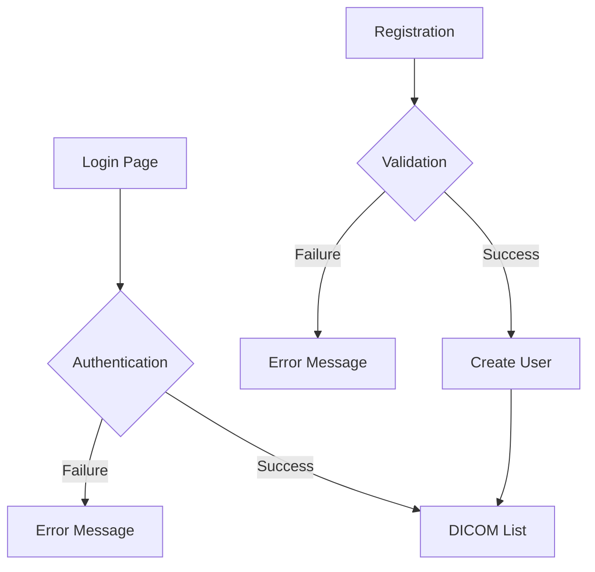
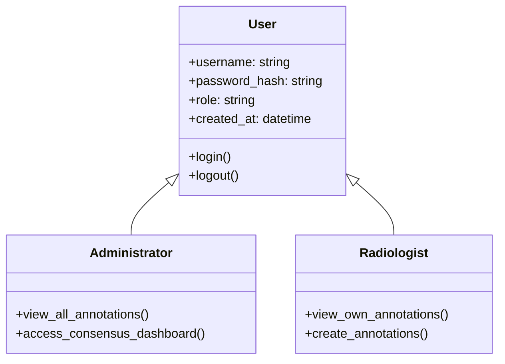
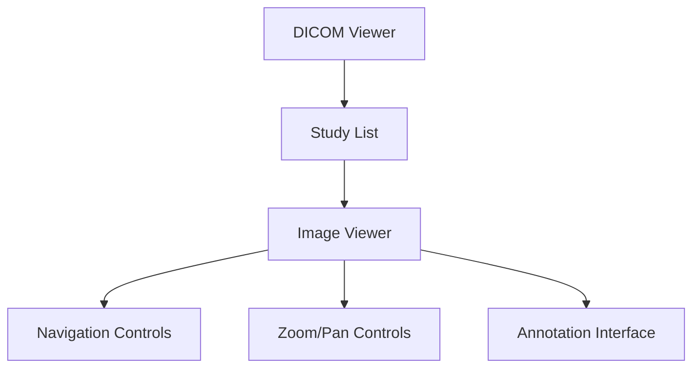
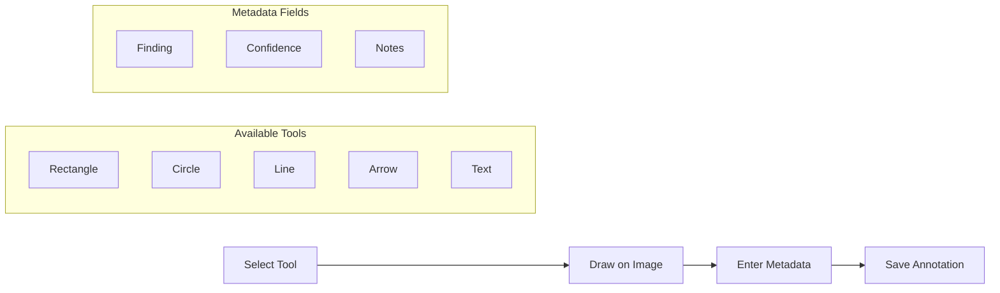
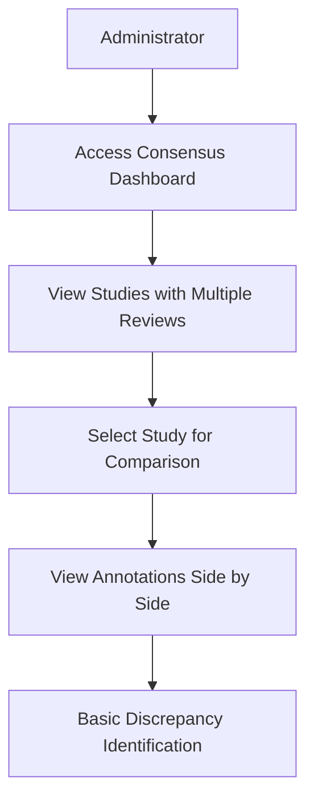
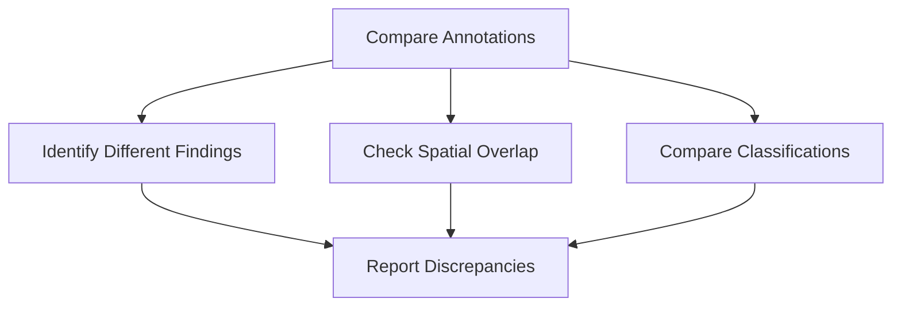
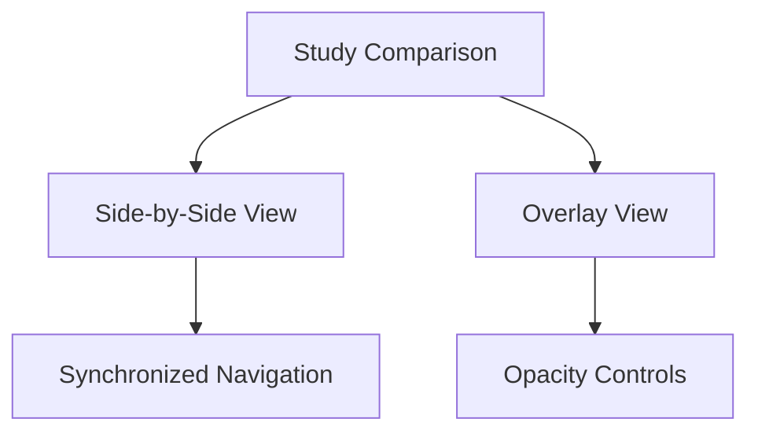
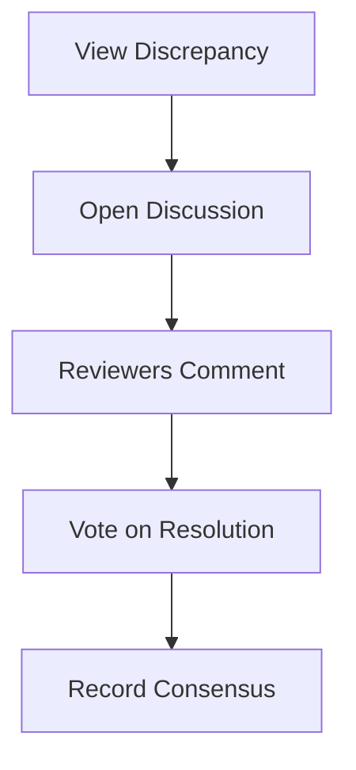
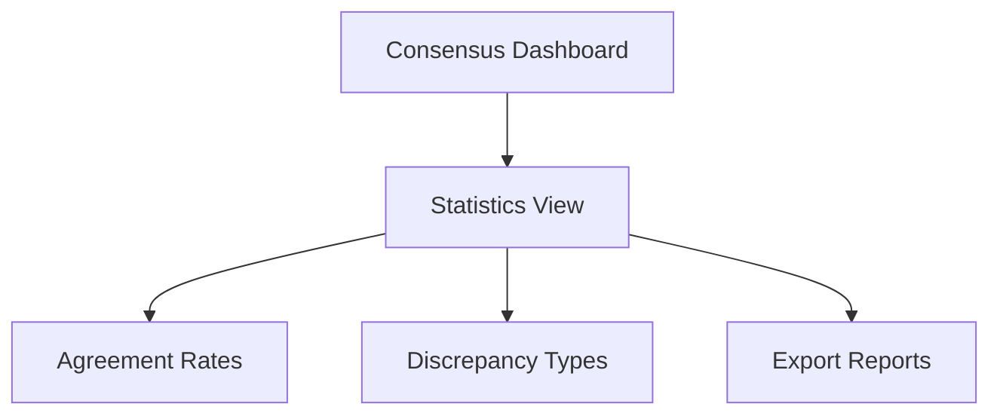

# 3. Core Features

## 3.1 User Authentication and Management

The DICOM Multi-Reviewer System implements a basic user authentication system to ensure secure access to the application.



**Workflow Explanation:** The authentication system allows users to log in with their credentials. Upon successful authentication, users are directed to the DICOM study list. New users can register through the registration form, which validates their information before creating their account with the radiologist role.

### User Roles

The system supports two user roles:



1. **Administrator**
   - Can view all annotations from all radiologists
   - Can access the consensus dashboard
   - Can view discrepancies between annotations

2. **Radiologist**
   - Can view and annotate studies
   - Can view their own annotations
   - Cannot access the consensus dashboard

Currently, new users can only register as radiologists through the self-registration system. Admin accounts must be created directly in the database.

### Login/Logout Process

The authentication process is implemented using Flask-Login:

```python
# From main.py
@app.route('/login', methods=['GET', 'POST'])
def login():
    if current_user.is_authenticated:
        return redirect(url_for('dicom_list'))
        
    if request.method == 'POST':
        username = request.form.get('username')
        password = request.form.get('password')
        remember = 'remember' in request.form
        
        user = User.query.filter_by(username=username).first()
        
        if user and user.check_password(password):
            login_user(user, remember=remember)
            user.last_login = datetime.utcnow()
            db.session.commit()
            
            next_page = request.args.get('next')
            return redirect(next_page or url_for('dicom_list'))
        else:
            return render_template('login.html', error='Invalid username or password')
    
    return render_template('login.html')

@app.route('/logout')
@login_required
def logout():
    logout_user()
    return redirect(url_for('login'))
```

The login process:
1. User enters username and password
2. System validates credentials against the database
3. If valid, user is logged in and redirected to the DICOM list
4. If invalid, error message is displayed

### User Registration

New users can register through the registration form:

```python
# From main.py
@app.route('/register', methods=['GET', 'POST'])
def register():
    if current_user.is_authenticated:
        return redirect(url_for('dicom_list'))
        
    if request.method == 'POST':
        username = request.form.get('username')
        email = request.form.get('email')
        password = request.form.get('password')
        confirm_password = request.form.get('confirm_password')
        full_name = request.form.get('full_name')
        
        # Validate inputs
        if not username or not email or not password or not full_name:
            return render_template('register.html', error='All fields are required')
            
        if password != confirm_password:
            return render_template('register.html', error='Passwords do not match')
            
        if User.query.filter_by(username=username).first():
            return render_template('register.html', error='Username already exists')
            
        if User.query.filter_by(email=email).first():
            return render_template('register.html', error='Email already exists')
        
        # Create new user
        user = User(
            username=username,
            email=email,
            full_name=full_name,
            role='radiologist'  # Default role
        )
        user.set_password(password)
        
        db.session.add(user)
        db.session.commit()
        
        # Log the user in
        login_user(user)
        
        return redirect(url_for('dicom_list'))
    
    return render_template('register.html')
```

## 3.2 DICOM Viewing

The DICOM Viewing component provides a basic interface for viewing medical images in the DICOM format.



**Workflow Explanation:** The DICOM viewing workflow begins with the study list, where users select a study to view. The system displays the images with basic navigation and zoom/pan controls, and provides access to the annotation tools.

### Study Selection Interface

The study selection interface displays a list of available DICOM studies:

```python
# From main.py
@app.route('/dicom')
@login_required
def dicom_list():
    return render_template('dicom_list.html')

@app.route('/api/dicom/studies')
@login_required
def get_dicom_studies():
    try:
        studies = parse_dicom_directory()
        return jsonify(studies)
    except Exception as e:
        logger.error(f"Error getting DICOM studies: {e}")
        return jsonify({"error": str(e)}), 500
```

Key features:
- Lists all available studies with patient ID, name, and study date
- Provides direct access to the viewer for each study

### Image Viewing Controls

The image viewer provides basic controls for navigating and manipulating DICOM images:

```javascript
// From annotation-viewer.js
// Basic zoom controls
let currentScale = 1.0;

document.getElementById('zoom-in').addEventListener('click', function() {
    currentScale += 0.1;
    applyZoom();
});

document.getElementById('zoom-out').addEventListener('click', function() {
    currentScale = Math.max(0.1, currentScale - 0.1);
    applyZoom();
});

document.getElementById('reset-view').addEventListener('click', function() {
    currentScale = 1.0;
    applyZoom();
});

function applyZoom() {
    dicomPreview.style.transform = `scale(${currentScale})`;
    canvas.style.transform = `scale(${currentScale})`;
}
```

Key features:
- Zoom in/out and reset view
- Pan image by dragging
- Navigate between images in a study

## 3.3 Annotation System

The Annotation System enables radiologists to mark and describe findings on medical images, forming the core functionality of the DICOM Multi-Reviewer System.



**Workflow Explanation:** The annotation process involves selecting a drawing tool, creating shapes on the image to mark regions of interest, entering metadata about the finding (including type, confidence level, and notes), and saving the annotation to the database for future reference and comparison.

### Annotation Tools

The system provides multiple drawing tools for marking regions of interest:

```javascript
// From annotation-viewer.js
function startDrawing(e) {
    if (!currentTool || !isDrawing) return;
    
    // Get mouse position relative to canvas
    const rect = canvas.getBoundingClientRect();
    const x = e.clientX - rect.left;
    const y = e.clientY - rect.top;
    
    // Start drawing
    isDrawing = true;
    startX = x;
    startY = y;
    
    // Create temporary shape based on selected tool
    switch (currentTool) {
        case 'rectangle':
            tempShape = {
                tool: 'rectangle',
                startX: x,
                startY: y,
                endX: x,
                endY: y
            };
            break;
        case 'circle':
            tempShape = {
                tool: 'circle',
                centerX: x,
                centerY: y,
                radius: 0
            };
            break;
        case 'line':
            tempShape = {
                tool: 'line',
                startX: x,
                startY: y,
                endX: x,
                endY: y
            };
            break;
        // Additional tools...
    }
}
```

1. **Rectangle Tool**
   - Draws a rectangular region
   - Defined by start and end coordinates
   - Used for marking rectangular areas of interest

2. **Circle Tool**
   - Draws a circular region
   - Defined by center point and radius
   - Used for marking rounded areas of interest

3. **Line Tool**
   - Draws a straight line
   - Defined by start and end points
   - Used for measuring distances or marking linear features

4. **Arrow Tool**
   - Draws a line with an arrowhead
   - Defined by start and end points
   - Used for pointing to specific features

5. **Text Tool**
   - Adds text annotations
   - Defined by position and content
   - Used for adding labels or comments directly on the image

### Annotation Metadata

Each annotation includes metadata to describe the finding:

```javascript
// From annotation-viewer.js
function saveAnnotation() {
    // Validate annotation data
    if (!currentAnnotation || currentAnnotation.shapes.length === 0) {
        alert('Please add at least one shape to the annotation.');
        return;
    }
    
    // Get metadata from form
    currentAnnotation.finding = document.getElementById('finding').value;
    currentAnnotation.confidence = parseInt(document.getElementById('confidence').value);
    currentAnnotation.notes = document.getElementById('notes').value;
    
    // Prepare data for API
    const annotationData = {
        id: currentAnnotation.id,
        studyUid: currentAnnotation.studyUid,
        seriesUid: currentAnnotation.seriesUid,
        instanceUid: currentAnnotation.instanceUid,
        finding: currentAnnotation.finding,
        confidence: currentAnnotation.confidence,
        notes: currentAnnotation.notes,
        shapes: currentAnnotation.shapes
    };
    
    // Send to server
    fetch('/api/annotations', {
        method: 'POST',
        headers: {
            'Content-Type': 'application/json',
        },
        body: JSON.stringify(annotationData)
    })
    .then(response => response.json())
    .then(data => {
        console.log('Annotation saved:', data);
        // Update UI
        loadAnnotations(studyUid);
    })
    .catch(error => {
        console.error('Error saving annotation:', error);
        alert('Error saving annotation. Please try again.');
    });
}
```

1. **Finding Field**
   - Text description of the radiological finding
   - Examples: "Nodule", "Mass", "Fracture", "Pneumonia"

2. **Confidence Level (1-10)**
   - Numeric rating of the reviewer's confidence in the finding
   - 1 = Very low confidence
   - 10 = Very high confidence

3. **Notes Field**
   - Free-text field for additional information
   - Can include differential diagnoses, recommendations, etc.

### Annotation Storage and Retrieval

Annotations are persistently stored in the database:

```python
# From annotation.py
class Annotation(db.Model):
    """
    Database model for persistent annotation storage
    """
    __tablename__ = 'annotations'
    
    id = db.Column(db.String(36), primary_key=True, default=lambda: str(uuid.uuid4()))
    study_uid = db.Column(db.String(64), nullable=False, index=True)
    series_uid = db.Column(db.String(64), nullable=True)
    instance_uid = db.Column(db.String(64), nullable=True)
    
    # Foreign key relationship with user
    reviewer_id = db.Column(db.Integer, db.ForeignKey('users.id'), nullable=False)
    reviewer = db.relationship('User', backref=db.backref('annotations', lazy=True))
    
    # Annotation metadata
    finding = db.Column(db.String(255), nullable=True)
    confidence_level = db.Column(db.Float, default=0.0)
    notes = db.Column(db.Text, nullable=True)
    
    # Consensus-related fields
    consensus_status = db.Column(db.String(20), default='pending')  # pending, agreed, disputed
    consensus_score = db.Column(db.Float, default=0.0)  # Agreement score (0-1)
    is_consensus_result = db.Column(db.Boolean, default=False)  # Whether this annotation is a consensus result
    
    # Annotation data (stored as JSON)
    _region_data = db.Column('region_data', db.Text, nullable=True)
    
    # Timestamps
    created_at = db.Column(db.DateTime, default=datetime.utcnow, nullable=False)
    updated_at = db.Column(db.DateTime, default=datetime.utcnow, onupdate=datetime.utcnow, nullable=False)
```

Key features:
- Annotations are linked to specific studies, series, and instances
- Each annotation is associated with a specific reviewer
- Shape data is stored as JSON, allowing for multiple shapes per annotation
- Timestamps track creation and modification times
- Consensus-related fields track the status of annotations in consensus review

## 3.4 Consensus Dashboard

The Consensus Dashboard provides a way to compare annotations from multiple reviewers for the same study. It is currently in a **partial implementation state** with basic functionality available.



**Current Implementation Status:**
- ✅ Basic dashboard UI showing studies with multiple reviews
- ✅ Side-by-side viewing of annotations from different reviewers
- ⚠️ Basic discrepancy identification (limited to finding differences)
- ❌ Advanced spatial analysis for overlapping annotations
- ❌ Statistical comparison of reviewer agreement
- ❌ Discussion thread functionality
- ❌ Consensus building interface

**Workflow Explanation:** Administrators can access the Consensus Dashboard to view studies that have been annotated by multiple reviewers. They can select a study to compare annotations side-by-side. The system provides basic identification of differences in findings, but advanced discrepancy detection algorithms (spatial analysis, classification comparison) are not yet fully implemented.

### Discrepancy Detection Mechanism

The current implementation includes a basic framework for discrepancy detection with the following limitations:

- **Finding Discrepancies**: The system can detect when different reviewers have assigned different findings to annotations.
- **Spatial Discrepancies**: The system has placeholder code for detecting spatial overlaps between annotations, but the required geometric libraries (shapely) are not currently integrated.
- **Classification Discrepancies**: The system can identify when reviewers have classified the same region differently, but only through basic string comparison.



**Note:** The consensus engine is currently a placeholder implementation. Advanced features such as statistical analysis of agreement rates, spatial overlap calculations, and automated consensus suggestions are planned but not yet implemented.

## 3.5 Future Planned Features

The following features are planned for future implementation in the DICOM Multi-Reviewer System, based on the established development priorities:

### 1. Persistent Annotation Storage

The first development priority is to implement persistent annotation storage to replace the current in-memory storage:
- Enhanced database schema for annotations
- Improved query performance for large datasets
- Backup and recovery mechanisms

### 2. Enhanced Consensus Dashboard

While the basic Consensus Dashboard is implemented, several key components are planned for future development:

#### Study Comparison View



**Planned Workflow Explanation:** The enhanced Study Comparison View will provide both side-by-side and overlay viewing modes with synchronized navigation between images. Users will be able to adjust opacity settings for better visualization of differences.

#### Enhanced Discrepancy Detection Algorithm

The current discrepancy detection will be enhanced with:
- Improved spatial analysis for more accurate overlap detection
- Machine learning-assisted detection of subtle differences
- Configurable sensitivity settings for different use cases

#### Consensus Building Interface



**Planned Workflow Explanation:** For each identified discrepancy, reviewers will be able to discuss their interpretations, provide additional context, and vote on the correct interpretation. The system will record the consensus decision, which can be used for final reporting and quality improvement.

#### Statistics and Reporting



**Planned Workflow Explanation:** The Statistics and Reporting feature will calculate metrics such as inter-reviewer agreement rates, common types of discrepancies, and individual reviewer performance. These reports can be exported for quality assurance and training purposes.

### 3. Administrator User Management

Future versions will enhance the administrator role with additional capabilities:
- User management interface
- Ability to invite radiologists to consensus sessions
- User activity monitoring and reporting

### 4. Series Navigation

Future versions will include enhanced navigation between different series within a study:
- List all series within a study
- Display series description and modality
- Allow selection of specific series for viewing
- Provide thumbnail previews where available
