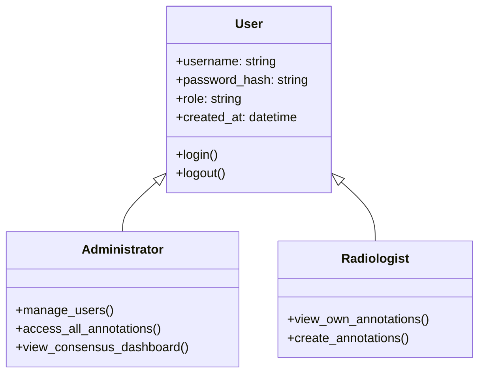
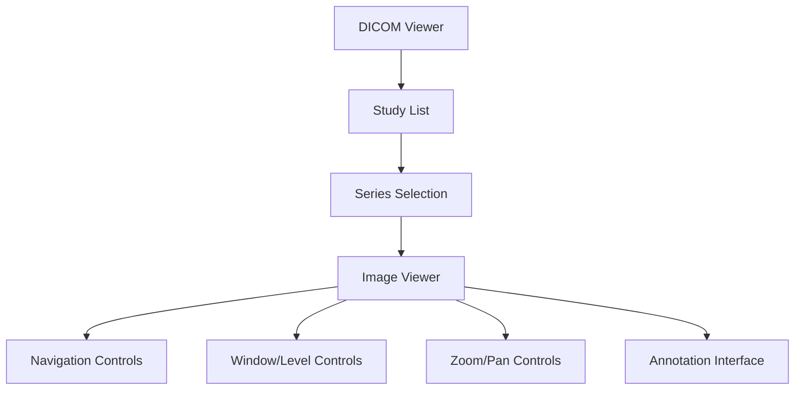
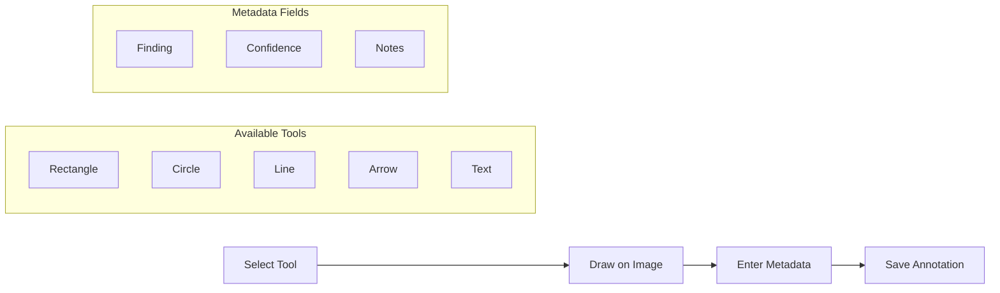
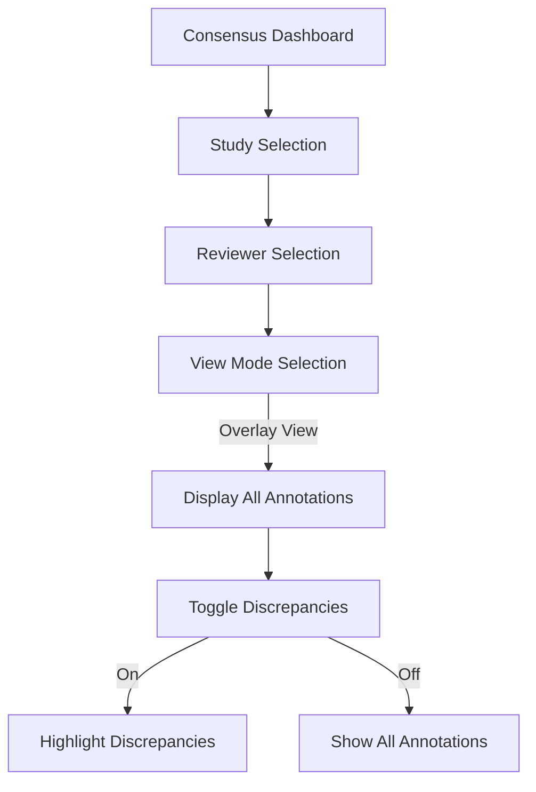

# 3. Core Features

## 3.1 User Authentication and Management

The DICOM Multi-Reviewer System implements a comprehensive user authentication and management system to ensure secure access and appropriate permissions for different user roles.

### User Roles

The system supports two primary user roles:



1. **Administrator**
   - Full access to all system features
   - Can manage user accounts
   - Can view all annotations from all radiologists
   - Can initiate and manage consensus sessions
   - Can generate reports and statistics

2. **Radiologist**
   - Can view and annotate assigned studies
   - Can only view their own annotations by default
   - Can participate in consensus sessions when invited
   - Can view discrepancies between their annotations and others' in consensus mode

### Login/Logout Process

The authentication process is implemented using Flask-Login:

```python
# From main.py
@app.route('/login', methods=['GET', 'POST'])
def login():
    if current_user.is_authenticated:
        return redirect(url_for('dicom_list'))
        
    if request.method == 'POST':
        username = request.form.get('username')
        password = request.form.get('password')
        remember = 'remember' in request.form
        
        user = User.query.filter_by(username=username).first()
        
        if user and user.check_password(password):
            login_user(user, remember=remember)
            user.last_login = datetime.utcnow()
            db.session.commit()
            
            next_page = request.args.get('next')
            return redirect(next_page or url_for('dicom_list'))
        else:
            return render_template('login.html', error='Invalid username or password')
    
    return render_template('login.html')

@app.route('/logout')
@login_required
def logout():
    logout_user()
    return redirect(url_for('login'))
```

The login process:
1. User enters credentials (username and password)
2. System verifies credentials against the database
3. If valid, a session is created and user is redirected to the main page
4. If invalid, an error message is displayed

The logout process:
1. User clicks logout
2. Session is terminated
3. User is redirected to the login page

### Default Accounts

Upon first startup, the system creates two default accounts:

```python
# From main.py - initialize_database function
if User.query.count() == 0:
    logger.info("Creating default users")
    admin = User(
        username='admin',
        email='admin@example.com',
        full_name='System Administrator',
        role='admin'
    )
    admin.set_password('admin')
    db.session.add(admin)
    
    radiologist = User(
        username='radiologist1',
        email='radiologist1@example.com',
        full_name='Test Radiologist',
        role='radiologist'
    )
    radiologist.set_password('password')
    db.session.add(radiologist)
    
    db.session.commit()
    logger.info("Default users created")
```

1. **Admin Account**
   - Username: admin
   - Password: admin
   - Role: Administrator

2. **Radiologist Account**
   - Username: radiologist1
   - Password: password
   - Role: Radiologist

### Adding New Users

New users can be added in two ways:

1. **Self-Registration** (if enabled):
   - User navigates to the registration page
   - Fills out the registration form with username, email, password, and full name
   - System creates a new account with the default "radiologist" role

```python
# From main.py
@app.route('/register', methods=['GET', 'POST'])
def register():
    if current_user.is_authenticated:
        return redirect(url_for('dicom_list'))
        
    if request.method == 'POST':
        username = request.form.get('username')
        email = request.form.get('email')
        password = request.form.get('password')
        confirm_password = request.form.get('confirm_password')
        full_name = request.form.get('full_name')
        
        # Validate inputs
        if not username or not email or not password or not full_name:
            return render_template('register.html', error='All fields are required')
            
        if password != confirm_password:
            return render_template('register.html', error='Passwords do not match')
            
        if User.query.filter_by(username=username).first():
            return render_template('register.html', error='Username already exists')
            
        if User.query.filter_by(email=email).first():
            return render_template('register.html', error='Email already exists')
        
        # Create new user
        user = User(
            username=username,
            email=email,
            full_name=full_name,
            role='radiologist'  # Default role
        )
        user.set_password(password)
        
        db.session.add(user)
        db.session.commit()
        
        # Log the user in
        login_user(user)
        
        return redirect(url_for('dicom_list'))
    
    return render_template('register.html')
```

2. **Administrator Creation**:
   - Admin logs in and accesses the user management interface
   - Fills out the new user form
   - Can specify the role (radiologist or admin)
   - System creates the new account

## 3.2 DICOM Viewing

The DICOM Viewing component provides a comprehensive interface for viewing and navigating medical images in the DICOM format.



### Study Selection Interface

The study selection interface displays a list of available DICOM studies:

```python
# From main.py
@app.route('/dicom')
@login_required
def dicom_list():
    return render_template('dicom_list.html')

@app.route('/api/dicom/studies')
@login_required
def get_dicom_studies():
    try:
        studies = parse_dicom_directory()
        return jsonify(studies)
    except Exception as e:
        logger.error(f"Error getting DICOM studies: {e}")
        return jsonify({"error": str(e)}), 500
```

Key features:
- Lists all available studies with patient ID, name, and study date
- Allows filtering and sorting of studies
- Displays study description and modality
- Provides direct access to the viewer for each study

### Series Navigation

Within each study, the system provides navigation between different series:

```javascript
// From simple-viewer.js
function loadStudy(studyUid) {
    // Load study metadata and series list
    fetch(`/api/dicom/${studyUid}/metadata`)
        .then(response => response.json())
        .then(metadata => {
            // Display series list
            const seriesList = document.getElementById('series-list');
            seriesList.innerHTML = '';
            
            metadata.series.forEach(series => {
                const seriesItem = document.createElement('div');
                seriesItem.className = 'series-item';
                seriesItem.textContent = `${series.description} (${series.modality})`;
                seriesItem.onclick = () => loadSeries(studyUid, series.seriesUid);
                seriesList.appendChild(seriesItem);
            });
            
            // Load first series by default
            if (metadata.series.length > 0) {
                loadSeries(studyUid, metadata.series[0].seriesUid);
            }
        })
        .catch(error => {
            console.error("Error loading study:", error);
        });
}
```

Key features:
- Lists all series within a study
- Displays series description and modality
- Allows selection of specific series for viewing
- Provides thumbnail previews where available

### Image Viewing Controls

The image viewer provides standard controls for navigating and manipulating DICOM images:

```javascript
// From annotation-viewer.js
// Basic zoom controls
let currentScale = 1.0;

document.getElementById('zoom-in').addEventListener('click', function() {
    currentScale += 0.1;
    applyZoom();
});

document.getElementById('zoom-out').addEventListener('click', function() {
    currentScale = Math.max(0.1, currentScale - 0.1);
    applyZoom();
});

document.getElementById('reset-view').addEventListener('click', function() {
    currentScale = 1.0;
    applyZoom();
});

function applyZoom() {
    dicomPreview.style.transform = `scale(${currentScale})`;
    canvas.style.transform = `scale(${currentScale})`;
}
```

Key features:
- Zoom in/out and reset view
- Pan image by dragging
- Navigate between images in a series
- Window/level adjustment for optimal contrast
- Measurement tools for distance and area

## 3.3 Annotation System

The Annotation System enables radiologists to mark and describe findings on medical images, forming the core functionality of the DICOM Multi-Reviewer System.



### Annotation Tools

The system provides multiple drawing tools for marking regions of interest:

```javascript
// From annotation-viewer.js
function startDrawing(e) {
    if (!currentTool || !isDrawing) return;
    
    // Get mouse position relative to canvas
    const rect = canvas.getBoundingClientRect();
    const x = e.clientX - rect.left;
    const y = e.clientY - rect.top;
    
    // Start drawing
    isDrawing = true;
    startX = x;
    startY = y;
    
    // Create temporary shape based on selected tool
    switch (currentTool) {
        case 'rectangle':
            tempShape = {
                tool: 'rectangle',
                startX: x,
                startY: y,
                endX: x,
                endY: y
            };
            break;
        case 'circle':
            tempShape = {
                tool: 'circle',
                centerX: x,
                centerY: y,
                radius: 0
            };
            break;
        case 'line':
            tempShape = {
                tool: 'line',
                startX: x,
                startY: y,
                endX: x,
                endY: y
            };
            break;
        // Additional tools...
    }
}
```

1. **Rectangle Tool**
   - Draws a rectangular region
   - Defined by start and end coordinates
   - Used for marking rectangular areas of interest

2. **Circle Tool**
   - Draws a circular region
   - Defined by center point and radius
   - Used for marking rounded areas of interest

3. **Line Tool**
   - Draws a straight line
   - Defined by start and end points
   - Used for measuring distances or marking linear features

4. **Arrow Tool**
   - Draws a line with an arrowhead
   - Defined by start and end points
   - Used for pointing to specific features

5. **Text Tool**
   - Adds text annotations
   - Defined by position and content
   - Used for adding labels or comments directly on the image

### Annotation Metadata

Each annotation includes metadata to describe the finding:

```javascript
// From annotation-viewer.js
function saveAnnotation() {
    // Validate annotation data
    if (!currentAnnotation || currentAnnotation.shapes.length === 0) {
        alert('Please add at least one shape to the annotation.');
        return;
    }
    
    // Get metadata from form
    currentAnnotation.finding = document.getElementById('finding').value;
    currentAnnotation.confidence = parseInt(document.getElementById('confidence').value);
    currentAnnotation.notes = document.getElementById('notes').value;
    
    // Prepare data for API
    const annotationData = {
        id: currentAnnotation.id,
        studyUid: currentAnnotation.studyUid,
        seriesUid: currentAnnotation.seriesUid,
        instanceUid: currentAnnotation.instanceUid,
        finding: currentAnnotation.finding,
        confidence: currentAnnotation.confidence,
        notes: currentAnnotation.notes,
        shapes: currentAnnotation.shapes
    };
    
    // Send to server
    fetch('/api/annotations', {
        method: 'POST',
        headers: {
            'Content-Type': 'application/json',
        },
        body: JSON.stringify(annotationData)
    })
    .then(response => response.json())
    .then(data => {
        console.log('Annotation saved:', data);
        // Update UI
        loadAnnotations(studyUid);
    })
    .catch(error => {
        console.error('Error saving annotation:', error);
        alert('Error saving annotation. Please try again.');
    });
}
```

1. **Finding Field**
   - Text description of the radiological finding
   - Examples: "Nodule", "Mass", "Fracture", "Pneumonia"

2. **Confidence Level (1-10)**
   - Numeric rating of the reviewer's confidence in the finding
   - 1 = Very low confidence
   - 10 = Very high confidence

3. **Notes Field**
   - Free-text field for additional information
   - Can include differential diagnoses, recommendations, etc.

### Annotation Storage and Retrieval

Annotations are persistently stored in the database:

```python
# From annotation.py
class Annotation(db.Model):
    """
    Database model for persistent annotation storage
    """
    __tablename__ = 'annotations'
    
    id = db.Column(db.String(36), primary_key=True, default=lambda: str(uuid.uuid4()))
    study_uid = db.Column(db.String(64), nullable=False, index=True)
    series_uid = db.Column(db.String(64), nullable=True)
    instance_uid = db.Column(db.String(64), nullable=True)
    
    # Foreign key relationship with user
    reviewer_id = db.Column(db.Integer, db.ForeignKey('users.id'), nullable=False)
    reviewer = db.relationship('User', backref=db.backref('annotations', lazy=True))
    
    # Annotation metadata
    finding = db.Column(db.String(255), nullable=True)
    confidence_level = db.Column(db.Float, default=0.0)
    notes = db.Column(db.Text, nullable=True)
    
    # Consensus-related fields
    consensus_status = db.Column(db.String(20), default='pending')  # pending, agreed, disputed
    consensus_score = db.Column(db.Float, default=0.0)  # Agreement score (0-1)
    is_consensus_result = db.Column(db.Boolean, default=False)  # Whether this annotation is a consensus result
    
    # Annotation data (stored as JSON)
    _region_data = db.Column('region_data', db.Text, nullable=True)
    
    # Timestamps
    created_at = db.Column(db.DateTime, default=datetime.utcnow, nullable=False)
    updated_at = db.Column(db.DateTime, default=datetime.utcnow, onupdate=datetime.utcnow, nullable=False)
```

Key features:
- Annotations are linked to specific studies, series, and instances
- Each annotation is associated with a specific reviewer
- Shape data is stored as JSON, allowing for multiple shapes per annotation
- Timestamps track creation and modification times
- Consensus-related fields track the status of annotations in consensus review

## 3.4 Consensus Dashboard

The Consensus Dashboard is a key feature that enables comparison of annotations from multiple reviewers and facilitates reaching consensus on discrepant findings.



### Accessing the Consensus Dashboard

The Consensus Dashboard is accessible to users with appropriate permissions:

```python
# From main.py
@app.route('/consensus')
@login_required
def consensus_dashboard():
    return redirect(url_for('consensus_dashboard_page'))

@app.route('/consensus/dashboard')
@login_required
def consensus_dashboard_page():
    """
    Render the consensus dashboard page.
    This page displays studies with multiple reviews for comparison.
    """
    return render_template('consensus_dashboard.html')
```

Key features:
- Available to administrators and radiologists participating in consensus sessions
- Displays a list of studies with multiple reviews
- Shows the number of reviewers and annotations per study
- Provides access to the consensus viewer for each study

### Overlay View for Multiple Annotations

The Consensus Viewer provides an overlay view to compare annotations from different reviewers:

```javascript
// From consensus.js
function drawOverlayView() {
    // Clear the canvas
    ctx.clearRect(0, 0, annotationCanvas.width, annotationCanvas.height);
    
    // Draw annotations from all active reviewers
    Object.keys(activeReviewers).forEach(reviewerId => {
        if (activeReviewers[reviewerId] && reviewerAnnotations[reviewerId]) {
            const color = activeReviewers[reviewerId].color;
            reviewerAnnotations[reviewerId].forEach(annotation => {
                drawAnnotation(annotation, color);
            });
        }
    });
    
    // Draw discrepancies if enabled
    if (showDiscrepancies) {
        drawDiscrepancies();
    }
}
```

Key features:
- Displays annotations from multiple reviewers on the same image
- Uses different colors to distinguish reviewers
- Allows toggling reviewers on/off for selective comparison
- Supports both overlay and side-by-side viewing modes

### Discrepancy Detection Mechanism

The system automatically detects discrepancies between annotations:

```javascript
// From consensus.js
function detectDiscrepancies() {
    discrepancies = [];
    
    // Get all active reviewers
    const activeReviewerIds = Object.keys(activeReviewers).filter(id => activeReviewers[id]);
    
    // Need at least 2 reviewers to detect discrepancies
    if (activeReviewerIds.length < 2) {
        return;
    }
    
    // Compare each pair of reviewers
    for (let i = 0; i < activeReviewerIds.length; i++) {
        for (let j = i + 1; j < activeReviewerIds.length; j++) {
            const reviewer1 = activeReviewerIds[i];
            const reviewer2 = activeReviewerIds[j];
            
            // Skip if either reviewer has no annotations
            if (!reviewerAnnotations[reviewer1] || !reviewerAnnotations[reviewer2]) {
                continue;
            }
            
            // Compare annotations between these two reviewers
            const pairDiscrepancies = compareAnnotations(reviewer1, reviewer2);
            discrepancies = discrepancies.concat(pairDiscrepancies);
        }
    }
    
    // Update the UI with discrepancy count
    updateDiscrepancyCount();
    updateDiscrepancyList();
}
```

The system detects three types of discrepancies:

1. **Spatial Discrepancies**
   - Annotations in similar locations with insufficient overlap
   - Calculated using geometric algorithms for different shape types
   - Configurable threshold for overlap percentage

2. **Classification Discrepancies**
   - Annotations in the same location but with different findings
   - Detected when overlapping regions have different finding labels
   - Highlights differences in diagnosis for the same feature

3. **Presence Discrepancies**
   - Findings marked by one reviewer but not others
   - Detected when a region has no corresponding annotations from other reviewers
   - Highlights potential missed findings

### "Show Discrepancies" Functionality

The system provides a toggle to highlight detected discrepancies:

```javascript
// From consensus.js
// Discrepancy toggle
const discrepancyToggle = document.getElementById('show-discrepancies');
if (discrepancyToggle) {
    discrepancyToggle.addEventListener('change', (e) => {
        showDiscrepancies = e.target.checked;
        if (showDiscrepancies) {
            detectDiscrepancies();
            drawDiscrepancies();
        } else {
            // Clear discrepancy display
            discrepancyList.innerHTML = '';
            redrawAnnotations();
        }
    });
}

function drawDiscrepancies() {
    // Draw visual indicators for discrepancies
    discrepancies.forEach((discrepancy, index) => {
        // Draw based on discrepancy type
        switch (discrepancy.type) {
            case 'spatial':
                // Draw red outline around spatially discrepant regions
                discrepancy.annotations.forEach(annotation => {
                    drawAnnotationOutline(annotation, '#FF0000');
                });
                break;
            case 'classification':
                // Draw yellow outline around classification discrepancies
                discrepancy.annotations.forEach(annotation => {
                    drawAnnotationOutline(annotation, '#FFFF00');
                });
                break;
            case 'presence':
                // Draw green outline around presence discrepancies
                discrepancy.annotations.forEach(annotation => {
                    drawAnnotationOutline(annotation, '#00FF00');
                });
                break;
        }
    });
}
```

Key features:
- Toggle switch to show/hide discrepancy highlighting
- Color-coded visual indicators for different discrepancy types
- List of detected discrepancies with details
- Ability to click on a discrepancy to focus on the relevant region
- Statistics on the number and types of discrepancies
