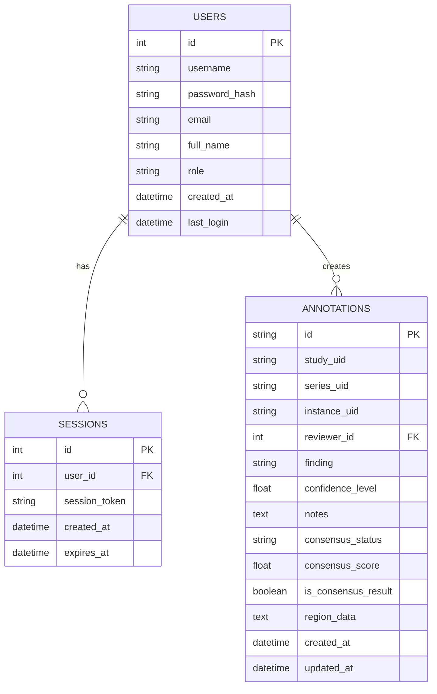

# 4. Database Schema

## 4.1 Database Structure

The DICOM Multi-Reviewer System uses SQLite as its database engine, providing a lightweight yet powerful storage solution. This section documents the database schema, including tables, relationships, and key fields.

> **Implementation Note:** While the database schema is defined as described below, the current system has a **partial implementation** of persistent storage. Some operations may still rely on in-memory data structures rather than fully utilizing the database capabilities.

### Database Tables Overview

The database consists of several interconnected tables that store user information, study metadata, and annotations:



### Users Table

The `users` table stores information about system users, including authentication details and role assignments:

```python
# From user.py
class User(db.Model, UserMixin):
    __tablename__ = 'users'
    
    id = db.Column(db.Integer, primary_key=True)
    username = db.Column(db.String(80), unique=True, nullable=False)
    password_hash = db.Column(db.String(128), nullable=False)
    email = db.Column(db.String(120), unique=True, nullable=False)
    full_name = db.Column(db.String(150), nullable=False)
    role = db.Column(db.String(20), nullable=False, default='radiologist')
    created_at = db.Column(db.DateTime, nullable=False, default=datetime.utcnow)
    last_login = db.Column(db.DateTime, nullable=True)
```

Key fields:
- `id`: Primary key, auto-incrementing integer
- `username`: Unique username for login
- `password_hash`: Bcrypt-hashed password
- `email`: Unique email address
- `full_name`: User's full name
- `role`: User role ('admin' or 'radiologist')
- `created_at`: Account creation timestamp
- `last_login`: Last login timestamp

### Sessions Table

The `sessions` table manages persistent user sessions:

```python
# From user.py
class Session(db.Model):
    __tablename__ = 'sessions'
    
    id = db.Column(db.Integer, primary_key=True)
    user_id = db.Column(db.Integer, db.ForeignKey('users.id'), nullable=False)
    session_token = db.Column(db.String(128), unique=True, nullable=False)
    created_at = db.Column(db.DateTime, nullable=False, default=datetime.utcnow)
    expires_at = db.Column(db.DateTime, nullable=False)
    
    user = db.relationship('User', backref=db.backref('sessions', lazy=True))
```

Key fields:
- `id`: Primary key, auto-incrementing integer
- `user_id`: Foreign key to the users table
- `session_token`: Unique token for session identification
- `created_at`: Session creation timestamp
- `expires_at`: Session expiration timestamp

### Annotations Table

The `annotations` table stores all annotation data created by reviewers:

```python
# From annotation.py
class Annotation(db.Model):
    __tablename__ = 'annotations'
    
    id = db.Column(db.String(36), primary_key=True, default=lambda: str(uuid.uuid4()))
    study_uid = db.Column(db.String(64), nullable=False, index=True)
    series_uid = db.Column(db.String(64), nullable=True)
    instance_uid = db.Column(db.String(64), nullable=True)
    reviewer_id = db.Column(db.Integer, db.ForeignKey('users.id'), nullable=False)
    finding = db.Column(db.String(255), nullable=True)
    confidence_level = db.Column(db.Float, default=0.0)
    notes = db.Column(db.Text, nullable=True)
    consensus_status = db.Column(db.String(20), default='pending')
    consensus_score = db.Column(db.Float, default=0.0)
    is_consensus_result = db.Column(db.Boolean, default=False)
    _region_data = db.Column('region_data', db.Text, nullable=True)
    created_at = db.Column(db.DateTime, default=datetime.utcnow, nullable=False)
    updated_at = db.Column(db.DateTime, default=datetime.utcnow, onupdate=datetime.utcnow, nullable=False)
    
    reviewer = db.relationship('User', backref=db.backref('annotations', lazy=True))
```

Key fields:
- `id`: UUID primary key
- `study_uid`, `series_uid`, `instance_uid`: DICOM identifiers
- `reviewer_id`: Foreign key to the users table
- `finding`: Classification of the annotation
- `confidence_level`: Reviewer's confidence (0-1)
- `notes`: Additional notes about the finding
- `consensus_status`: Status in consensus review process
- `consensus_score`: Agreement score in consensus review
- `is_consensus_result`: Flag for consensus result annotations
- `region_data`: JSON-encoded shape data

#### Implementation Status

> **Current Status:** ⚠️ **Partially Implemented**
> 
> While the database model is fully defined, the current implementation has the following limitations:
> - Some annotation operations may still use in-memory storage rather than fully persisting to the database
> - The consensus-related fields (`consensus_status`, `consensus_score`, `is_consensus_result`) are defined but not fully utilized by the consensus engine
> - The `region_data` field stores geometric information, but the system lacks the geometric libraries (shapely) needed for advanced spatial analysis
> 
> **Development Priority:** Completing the persistent annotation storage is the first priority in the development roadmap.

- `created_at`, `updated_at`: Timestamps

### Table Relationships

The database schema includes the following key relationships:

1. **User to Annotations**: One-to-many relationship where each user can create multiple annotations
   ```python
   reviewer_id = db.Column(db.Integer, db.ForeignKey('users.id'), nullable=False)
   reviewer = db.relationship('User', backref=db.backref('annotations', lazy=True))
   ```

2. **User to Sessions**: One-to-many relationship where each user can have multiple login sessions
   ```python
   user_id = db.Column(db.Integer, db.ForeignKey('users.id'), nullable=False)
   user = db.relationship('User', backref=db.backref('sessions', lazy=True))
   ```

This database schema provides a solid foundation for the DICOM Multi-Reviewer System, enabling persistent storage of user data and annotations while maintaining proper relationships between different entities.
