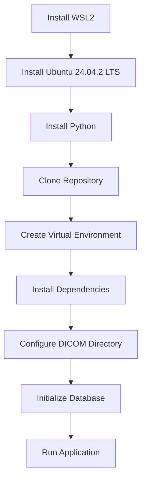

# 5. Installation and Deployment

## 5.1 System Requirements

The DICOM Multi-Reviewer System has specific hardware and software requirements to ensure optimal performance and functionality.

### Hardware Requirements

- **Processor**: Modern multi-core CPU (Intel i5/AMD Ryzen 5 or better)
- **Memory**: Minimum 8GB RAM, 16GB recommended
- **Storage**: At least 10GB free space for the application and database
- **Additional storage**: Sufficient space for DICOM files (varies based on study count)

### Software Prerequisites

- **Operating System**:
  - Windows 10/11 with Windows Subsystem for Linux 2 (WSL2)
  - Ubuntu 24.04.2 LTS or compatible Linux distribution
  - macOS 12+ (alternative deployment option)

- **Required Software**:
  - Python 3.9 or higher
  - pip package manager
  - Git version control
  - SQLite (included with Python)

- **Optional Software**:
  - Visual Studio Code with Remote WSL extension (recommended IDE)
  - Docker (for containerized deployment)

### Network Requirements

- **Local Deployment**: No specific network requirements for local usage
- **Shared Deployment**: 
  - Internal network with sufficient bandwidth for DICOM file transfer
  - Firewall configuration to allow access to port 5000 (default)

### Browser Compatibility

The web interface is compatible with modern browsers:
- Google Chrome 90+
- Mozilla Firefox 88+
- Microsoft Edge 90+
- Safari 14+

## 5.2 Installation Guide

This section provides a comprehensive guide for installing the DICOM Multi-Reviewer System in a WSL2 environment.



### WSL2 and Ubuntu Setup

1. **Enable WSL2 on Windows**:
   ```powershell
   # Open PowerShell as Administrator and run:
   dism.exe /online /enable-feature /featurename:Microsoft-Windows-Subsystem-Linux /all /norestart
   dism.exe /online /enable-feature /featurename:VirtualMachinePlatform /all /norestart
   
   # Restart your computer
   
   # Set WSL2 as default
   wsl --set-default-version 2
   ```

2. **Install Ubuntu 24.04.2 LTS**:
   - Install from the Microsoft Store, or
   - Download and install manually from the Ubuntu website

3. **Initialize Ubuntu**:
   - Launch Ubuntu from the Start menu
   - Create a username and password when prompted
   - Update the system:
     ```bash
     sudo apt update && sudo apt upgrade -y
     ```

### Repository Setup

1. **Install Required Packages**:
   ```bash
   sudo apt install -y python3 python3-pip python3-venv git
   ```

2. **Create Project Directory**:
   ```bash
   mkdir -p ~/dicom-research
   cd ~/dicom-research
   ```

3. **Clone the Repository**:
   ```bash
   git clone https://github.com/mgadaphy/dicom-research.git
   cd dicom-research/multi-reviewer
   ```

### Python Environment Setup

1. **Create a Virtual Environment**:
   ```bash
   python3 -m venv venv
   source venv/bin/activate
   ```

2. **Install Dependencies**:
   ```bash
   pip install -r requirements.txt
   ```

### DICOM Directory Configuration

1. **Create DICOM Files Directory**:
   ```bash
   mkdir -p ~/dicom-research/dicom-files
   ```

2. **Add Sample DICOM Files**:
   - Download sample DICOM files from recommended sources:
     - MAGNETOM Free.Max Sample Data from Siemens Healthineers
     - Orthanc Sample Files from [orthanc-server/orthanc-setup-samples](https://github.com/orthanc-server/orthanc-setup-samples/tree/master/dicomFiles)
   - Place the files in the `~/dicom-research/dicom-files` directory

3. **Update DICOM Directory Path** (if needed):
   - Edit `src/dicom_reviewer/main.py`:
     ```python
     # Update this line to match your DICOM files location
     DICOM_DIR = '/home/yourusername/dicom-research/dicom-files'
     ```

### Database Initialization

The database will be automatically initialized when you first run the application. This process:
- Creates all required tables
- Runs necessary migrations
- Creates default user accounts

### Running the Application

1. **Navigate to the Project Directory**:
   ```bash
   cd ~/dicom-research/multi-reviewer
   ```

2. **Activate the Virtual Environment**:
   ```bash
   source venv/bin/activate
   ```

3. **Run the Application**:
   ```bash
   PYTHONPATH=$(pwd) python src/dicom_reviewer/main.py
   ```

4. **Access the Application**:
   - Open a web browser and navigate to:
     - http://127.0.0.1:5000 or
     - http://localhost:5000

5. **Login with Default Credentials**:
   - Admin: username `admin`, password `admin`
   - Radiologist: username `radiologist1`, password `password`

## 5.3 Deployment Options

The DICOM Multi-Reviewer System can be deployed in various environments depending on your needs.

### Development Server Deployment

The built-in Flask development server is suitable for development and testing:

```bash
# From the project root directory
source venv/bin/activate
PYTHONPATH=$(pwd) python src/dicom_reviewer/main.py
```

Key considerations:
- Debug mode is enabled by default (`app.run(debug=True)`)
- Not suitable for production use due to security and performance limitations
- Automatically reloads when code changes are detected

### Production Deployment with Gunicorn

For production environments, use Gunicorn as a WSGI server:

1. **Install Gunicorn**:
   ```bash
   pip install gunicorn
   ```

2. **Create a WSGI Entry Point** (if not already present):
   Create a file named `wsgi.py` in the project root:
   ```python
   import sys
   import os
   
   # Add the src directory to the Python path
   sys.path.insert(0, os.path.abspath(os.path.join(os.path.dirname(__file__), 'src')))
   
   from dicom_reviewer.main import app
   
   if __name__ == "__main__":
       app.run()
   ```

3. **Run with Gunicorn**:
   ```bash
   gunicorn -w 4 -b 0.0.0.0:5000 wsgi:app
   ```

4. **Create a Systemd Service** (for automatic startup):
   Create a file at `/etc/systemd/system/dicom-reviewer.service`:
   ```ini
   [Unit]
   Description=DICOM Multi-Reviewer Gunicorn Service
   After=network.target
   
   [Service]
   User=yourusername
   Group=yourusername
   WorkingDirectory=/home/yourusername/dicom-research/multi-reviewer
   Environment="PATH=/home/yourusername/dicom-research/multi-reviewer/venv/bin"
   ExecStart=/home/yourusername/dicom-research/multi-reviewer/venv/bin/gunicorn -w 4 -b 0.0.0.0:5000 wsgi:app
   
   [Install]
   WantedBy=multi-user.target
   ```

5. **Enable and Start the Service**:
   ```bash
   sudo systemctl enable dicom-reviewer
   sudo systemctl start dicom-reviewer
   ```

### Database Considerations for Production

For production deployment, consider these database enhancements:

1. **Separate Database Directory**:
   - Store the SQLite database in a dedicated directory with appropriate permissions
   - Update the database path in `main.py`:
     ```python
     db_path = '/path/to/production/database/dicom_reviewer.db'
     ```

2. **Regular Backups**:
   - Implement automated backups using cron jobs:
     ```bash
     # Example cron job for daily backups at 2 AM
     0 2 * * * sqlite3 /path/to/dicom_reviewer.db ".backup '/path/to/backups/dicom_reviewer_$(date +\%Y\%m\%d).db'"
     ```

3. **Database Optimization**:
   - Periodically run VACUUM to optimize the database:
     ```bash
     sqlite3 /path/to/dicom_reviewer.db "VACUUM;"
     ```

### Security Recommendations

For secure deployment, implement these measures:

1. **Use HTTPS**:
   - Deploy behind a reverse proxy (Nginx or Apache) with SSL/TLS
   - Obtain and configure SSL certificates (Let's Encrypt is a free option)

2. **Update Secret Key**:
   - Replace the development secret key with a strong, random key
   - Set it as an environment variable rather than hardcoding:
     ```bash
     export SECRET_KEY="your-secure-random-key"
     ```

3. **Implement Rate Limiting**:
   - Add rate limiting to prevent brute force attacks
   - Consider using Flask-Limiter extension

4. **Regular Updates**:
   - Keep all dependencies updated to patch security vulnerabilities:
     ```bash
     pip install --upgrade -r requirements.txt
     ```

5. **Access Control**:
   - Restrict network access to the application server
   - Use firewall rules to limit access to authorized networks

By following these installation and deployment guidelines, you can set up the DICOM Multi-Reviewer System in various environments, from development workstations to production servers, while maintaining security and performance.
