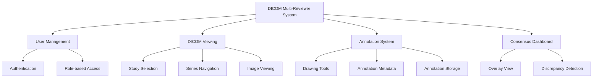

# 1. Introduction

## 1.1 System Overview

The DICOM Multi-Reviewer System is a collaborative medical imaging platform designed to reduce diagnostic errors in radiology through consensus review. This system enables multiple radiologists to independently annotate the same medical images and then identifies and resolves discrepancies in their diagnoses.

### Purpose and Goals

The primary purpose of the DICOM Multi-Reviewer System is to improve diagnostic accuracy in radiology by facilitating collaborative review of medical images. The specific goals include:

1. **Reduce Diagnostic Errors**: By enabling multiple independent reviews of the same study, the system helps identify potential errors or oversights that might occur with a single reviewer.

2. **Standardize Annotation Process**: The system provides consistent tools and methodologies for marking and describing findings across different reviewers.

3. **Facilitate Consensus Building**: When discrepancies occur between reviewers, the system provides tools to identify, discuss, and resolve these differences.

4. **Improve Radiologist Training**: By comparing annotations from different reviewers, the system can serve as an educational tool for less experienced radiologists.

5. **Create Audit Trail**: The system maintains a comprehensive record of all annotations, discussions, and consensus decisions for quality assurance and research purposes.

### Key Features and Capabilities

The DICOM Multi-Reviewer System offers a comprehensive set of features:

1. **DICOM Image Viewing**: Browser-based viewing of DICOM medical images with standard navigation controls.

2. **Annotation Tools**: Multi-shape drawing tools for identifying and marking areas of interest, including rectangles, circles, lines, arrows, and text annotations.

3. **User Authentication**: Role-based access with separate radiologist and administrator views to ensure appropriate permissions.

4. **Collaborative Review**: Tools to enable multiple radiologists to review the same studies independently.

5. **Discrepancy Detection**: Automatic identification of spatial, classification, and presence discrepancies between reviewers.

6. **Consensus Building**: Tools to facilitate reaching consensus on discrepant findings through discussions and voting.

7. **Persistent Annotations**: All annotations are saved to the database and preserved between sessions.

### Target Users

The system is designed for two primary user roles:

1. **Radiologists**: Medical professionals who review and annotate DICOM images. They can:
   - View assigned studies
   - Create and edit annotations
   - Participate in consensus discussions
   - View discrepancies between their annotations and others'

2. **Administrators**: System managers who oversee the review process. They can:
   - Manage user accounts
   - Access all annotations from all reviewers
   - Initiate consensus review sessions
   - Generate reports on discrepancies and consensus

### High-Level Architecture

The DICOM Multi-Reviewer System follows a client-server architecture with a web-based interface. The system is built using modern web technologies and follows a modular design approach.

The system is composed of several interconnected components:

1. **Backend Server**: A Flask-based Python application that handles data processing, storage, and business logic.

2. **Database**: A SQLite database that stores user information, annotations, and consensus data.

3. **Frontend Client**: A browser-based interface built with HTML, CSS, and JavaScript that provides the user interface.

4. **DICOM Processing**: Specialized components for parsing and displaying DICOM medical images.

5. **Annotation Engine**: Tools for creating, storing, and retrieving annotations.

6. **Consensus Engine**: Components for comparing annotations, detecting discrepancies, and facilitating consensus building.

This architecture allows for scalability, maintainability, and future enhancements while providing a seamless experience for radiologists and administrators.
