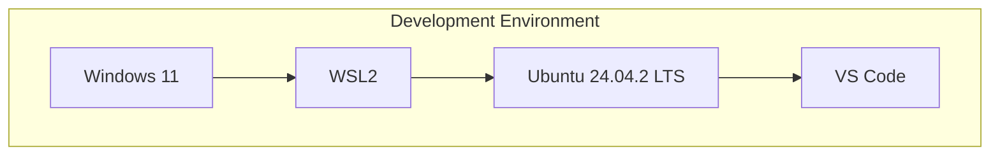
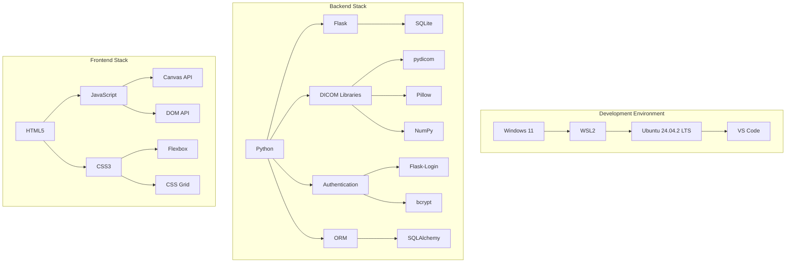
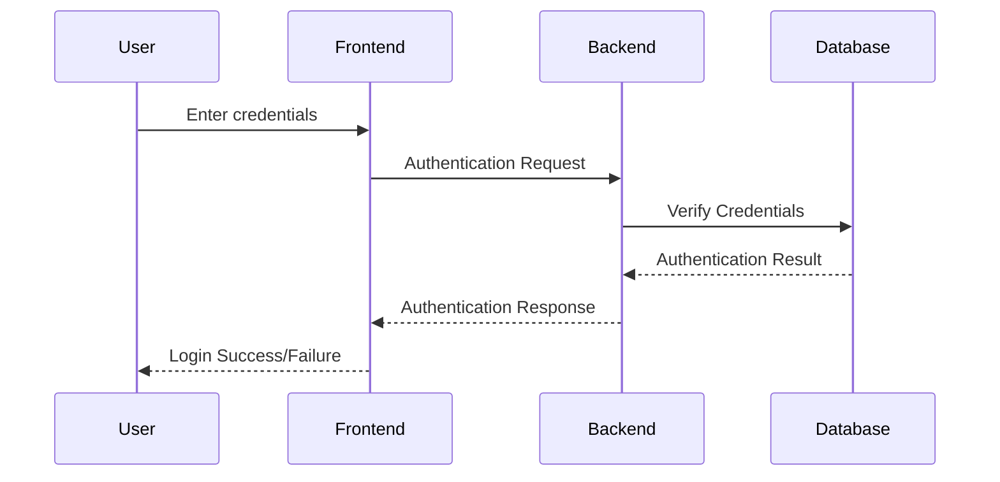
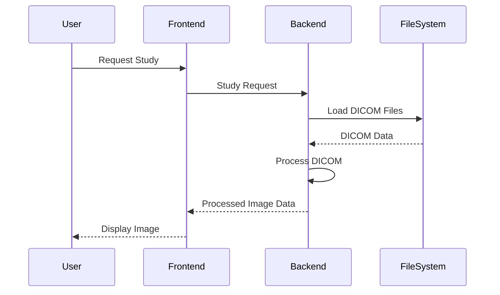
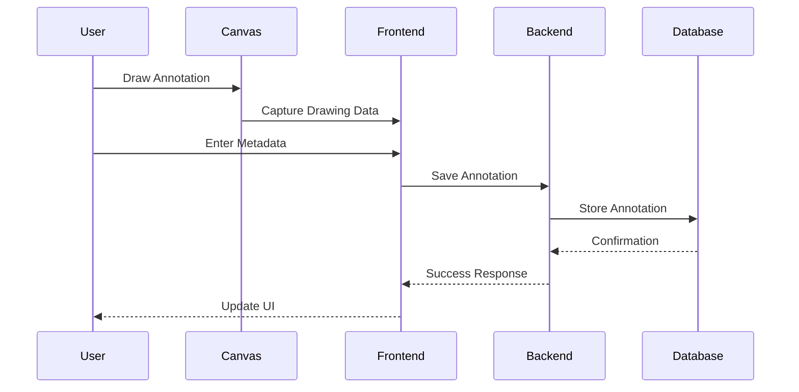
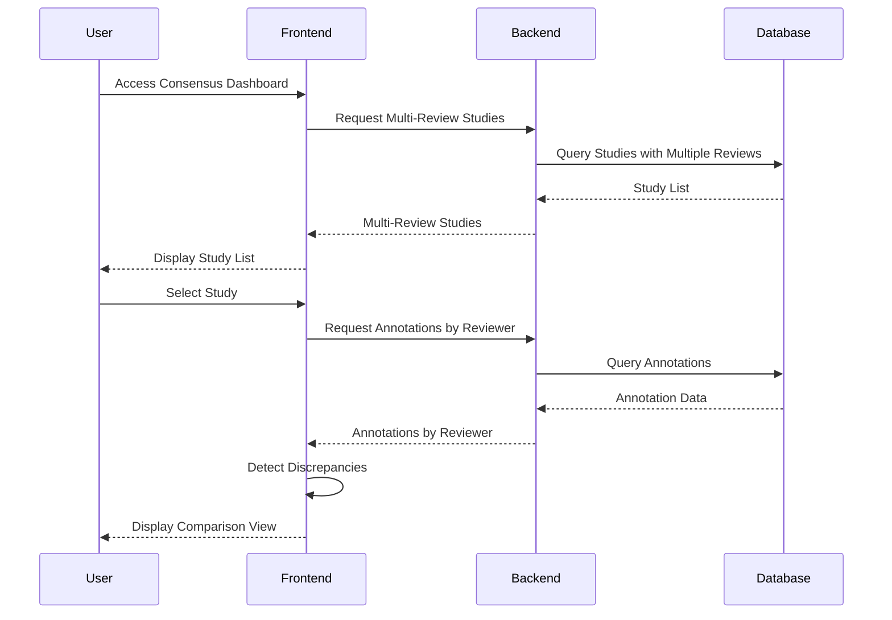
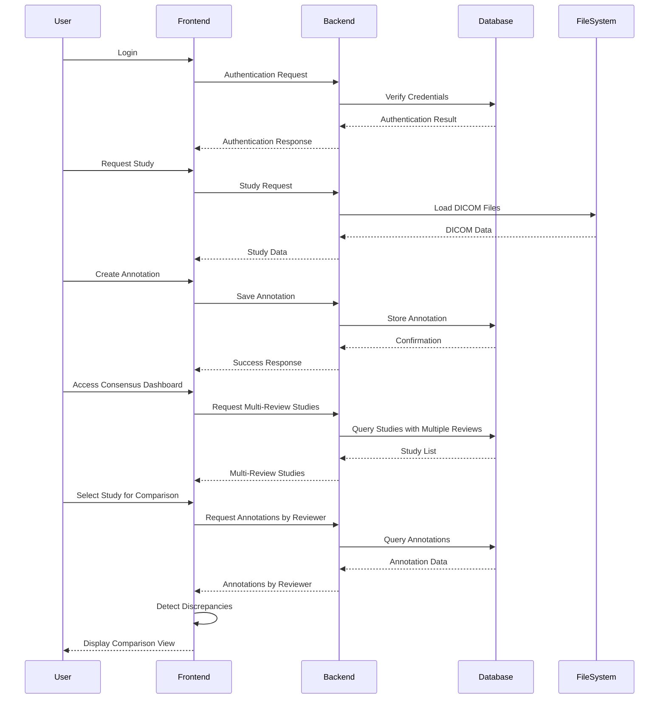

# 2. System Architecture

## 2.1 Technical Stack

The DICOM Multi-Reviewer System is built using a modern technology stack that balances performance, maintainability, and ease of development. This section details the complete technical stack used in the system.

### Development Environment

The system is developed and tested in the following environment:

- **Host Operating System**: Windows 11
- **Virtualization**: Windows Subsystem for Linux 2 (WSL2)
- **Linux Distribution**: Ubuntu 24.04.2 LTS
- **IDE**: Visual Studio Code with Remote WSL extension
- **Version Control**: Git



### Backend Components

The server-side components of the system include:

- **Programming Language**: Python 3.9+
- **Web Framework**: Flask
- **Database**: SQLite
- **ORM**: SQLAlchemy
- **Authentication**: Flask-Login
- **Password Hashing**: bcrypt
- **DICOM Processing**: pydicom
- **Image Processing**: Pillow, NumPy

```python
# Example from main.py showing the core backend components
from flask import Flask, jsonify, render_template, request, send_file, abort, redirect, url_for
import os
import pydicom
from PIL import Image
import numpy as np
from flask_login import LoginManager, login_user, logout_user, login_required, current_user
from dicom_reviewer.models.db import db
from dicom_reviewer.models.db.user import User
from dicom_reviewer.models.db.annotation import Annotation
```

### Frontend Components

The client-side components of the system include:

- **Markup**: HTML5
- **Styling**: CSS3
- **Scripting**: JavaScript (ES6+)
- **Drawing**: HTML5 Canvas API
- **DOM Manipulation**: Native JavaScript
- **Responsive Design**: CSS Flexbox and Grid

```javascript
// Example from annotation-viewer.js showing frontend components
document.addEventListener('DOMContentLoaded', function() {
    // Canvas-based drawing for annotations
    const canvas = document.getElementById('annotation-canvas');
    const ctx = canvas.getContext('2d');
    
    // DOM manipulation for UI controls
    const toolButtons = document.querySelectorAll('.tool-button');
    toolButtons.forEach(button => {
        button.addEventListener('click', function() {
            // Tool selection logic
        });
    });
});
```

### Complete Technical Stack Diagram



## 2.2 System Components

The DICOM Multi-Reviewer System is composed of several interconnected components that work together to provide a comprehensive solution for collaborative radiology review. This section details these components and their interactions.

### Authentication System

The authentication system manages user access and security:



Key components:
- **User Model**: Defines user attributes and methods
- **LoginManager**: Handles session management
- **Password Hashing**: Secures user passwords with bcrypt
- **Role-Based Access Control**: Restricts access based on user role

```python
# Example from user.py showing authentication implementation
class User(db.Model, UserMixin):
    __tablename__ = 'users'
    
    id = db.Column(db.Integer, primary_key=True)
    username = db.Column(db.String(80), unique=True, nullable=False)
    password_hash = db.Column(db.String(128), nullable=False)
    email = db.Column(db.String(120), unique=True, nullable=False)
    role = db.Column(db.String(20), nullable=False, default='radiologist')
    
    def set_password(self, password):
        self.password_hash = bcrypt.hashpw(password.encode('utf-8'), bcrypt.gensalt()).decode('utf-8')
    
    def check_password(self, password):
        return bcrypt.checkpw(password.encode('utf-8'), self.password_hash.encode('utf-8'))
```

### DICOM Processing Pipeline

The DICOM processing pipeline handles loading, parsing, and displaying medical images:



Key components:
- **DICOM Parser**: Extracts metadata and pixel data from DICOM files
- **Image Converter**: Transforms DICOM images to browser-viewable formats
- **Metadata Extractor**: Retrieves patient and study information
- **Study/Series/Instance Hierarchy**: Organizes DICOM data in proper hierarchy

```python
# Example from dicom_parser.py showing DICOM processing
class DICOMParser:
    @staticmethod
    def parse_dicom_file(file_path):
        """Parse a DICOM file and extract metadata and image data."""
        try:
            # Load the DICOM file
            dicom_data = pydicom.dcmread(file_path)
            
            # Extract metadata
            metadata = {
                'studyUid': dicom_data.StudyInstanceUID,
                'seriesUid': dicom_data.SeriesInstanceUID,
                'instanceUid': dicom_data.SOPInstanceUID,
                'patientId': dicom_data.PatientID,
                'patientName': str(dicom_data.PatientName),
                'studyDate': dicom_data.StudyDate,
                'modality': dicom_data.Modality,
                'rows': dicom_data.Rows,
                'columns': dicom_data.Columns
            }
            
            # Convert pixel data to image
            pixel_array = dicom_data.pixel_array
            
            return metadata, pixel_array
        except Exception as e:
            print(f"Error parsing DICOM file: {e}")
            return None, None
```

### Annotation System Architecture

The annotation system enables users to mark and describe findings on medical images:



Key components:
- **Canvas Drawing Tools**: Interface for creating shapes on images
- **Annotation Model**: Data structure for storing annotation information
- **Persistence Layer**: Saves annotations to the database
- **Retrieval System**: Loads existing annotations for display

```javascript
// Example from annotation-viewer.js showing annotation creation
function saveAnnotation() {
    // Validate annotation data
    if (!currentAnnotation || currentAnnotation.shapes.length === 0) {
        alert('Please add at least one shape to the annotation.');
        return;
    }
    
    // Get metadata from form
    currentAnnotation.finding = document.getElementById('finding').value;
    currentAnnotation.confidence = parseInt(document.getElementById('confidence').value);
    currentAnnotation.notes = document.getElementById('notes').value;
    
    // Prepare data for API
    const annotationData = {
        id: currentAnnotation.id,
        studyUid: currentAnnotation.studyUid,
        seriesUid: currentAnnotation.seriesUid,
        instanceUid: currentAnnotation.instanceUid,
        finding: currentAnnotation.finding,
        confidence: currentAnnotation.confidence,
        notes: currentAnnotation.notes,
        shapes: currentAnnotation.shapes
    };
    
    // Send to server
    fetch('/api/annotations', {
        method: 'POST',
        headers: {
            'Content-Type': 'application/json',
        },
        body: JSON.stringify(annotationData)
    })
    .then(response => response.json())
    .then(data => {
        console.log('Annotation saved:', data);
        // Update UI
        loadAnnotations(studyUid);
    })
    .catch(error => {
        console.error('Error saving annotation:', error);
        alert('Error saving annotation. Please try again.');
    });
}
```

### Consensus Dashboard Components

The consensus dashboard facilitates comparison and resolution of discrepancies:



Key components:
- **Consensus Session Model**: Tracks review sessions between multiple reviewers
- **Discussion System**: Enables communication about discrepancies
- **Voting Mechanism**: Allows reviewers to agree or disagree with findings
- **Discrepancy Detection**: Identifies differences between annotations
- **Visualization Tools**: Displays multiple annotations for comparison

```python
# Example from consensus_engine.py showing discrepancy detection
class ConsensusEngine:
    @staticmethod
    def detect_discrepancies(annotations):
        """
        Detect and analyze differences in annotations.
        
        This method identifies discrepancies between annotations based on:
        1. Different findings for the same region
        2. Overlapping regions with different findings
        3. Significant differences in confidence levels
        """
        if len(annotations) < 2:
            return {"consensus_possible": True, "discrepancies": []}
        
        discrepancies = []
        
        # Group annotations by finding
        findings_dict = {}
        for ann in annotations:
            finding = ann.finding or "Unspecified"
            if finding not in findings_dict:
                findings_dict[finding] = []
            findings_dict[finding].append(ann)
        
        # Check for different findings
        unique_findings = list(findings_dict.keys())
        is_consensus_on_finding = len(unique_findings) <= 1
        
        if not is_consensus_on_finding:
            discrepancies.append({
                "type": "finding_mismatch",
                "description": f"Different findings detected: {', '.join(unique_findings)}",
                "findings": unique_findings
            })
        
        # Check for spatial discrepancies
        spatial_discrepancies = ConsensusEngine._detect_spatial_discrepancies(annotations)
        if spatial_discrepancies:
            discrepancies.extend(spatial_discrepancies)
        
        # Check for confidence level discrepancies
        confidence_discrepancies = ConsensusEngine._detect_confidence_discrepancies(annotations)
        if confidence_discrepancies:
            discrepancies.extend(confidence_discrepancies)
        
        return {
            "consensus_possible": len(discrepancies) == 0,
            "discrepancies": discrepancies,
            "total_annotations": len(annotations),
            "unique_findings": unique_findings
        }
```

### Data Flow Between Components

The overall data flow in the system follows this pattern:



This architecture provides a robust foundation for the system while maintaining flexibility for future enhancements and extensions.
