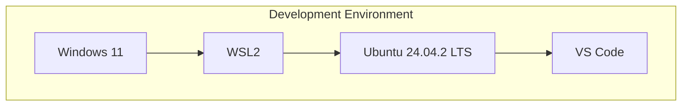
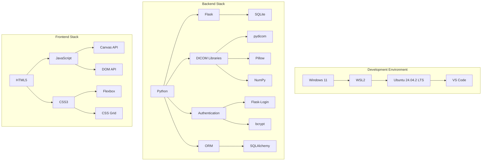
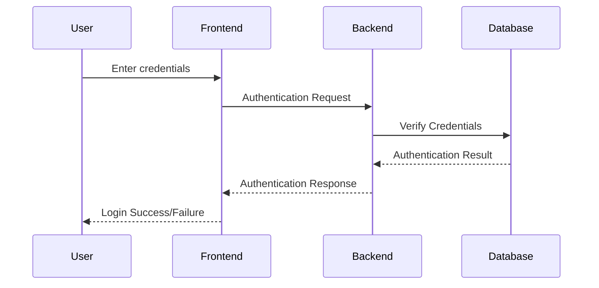
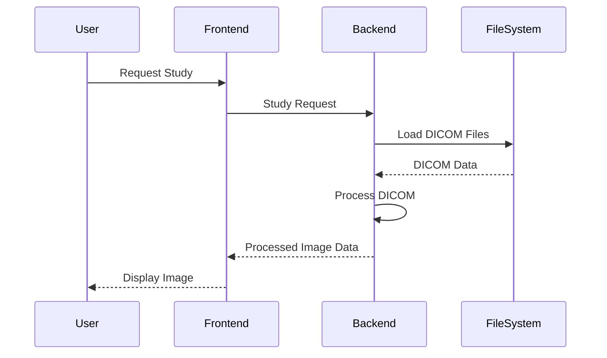
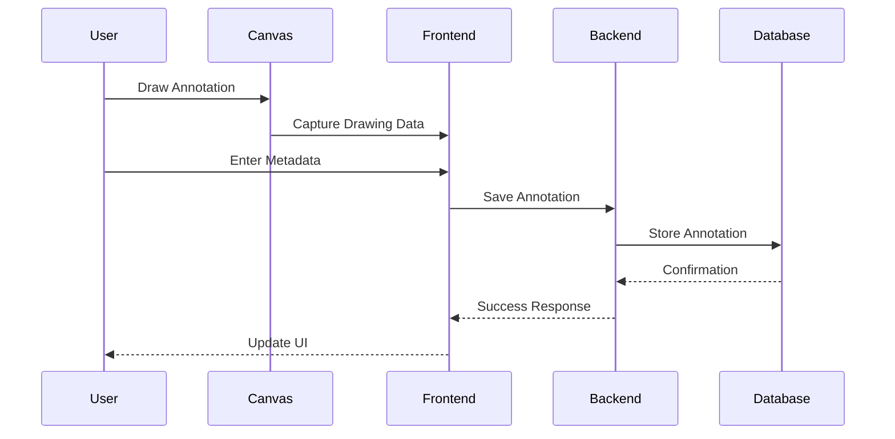
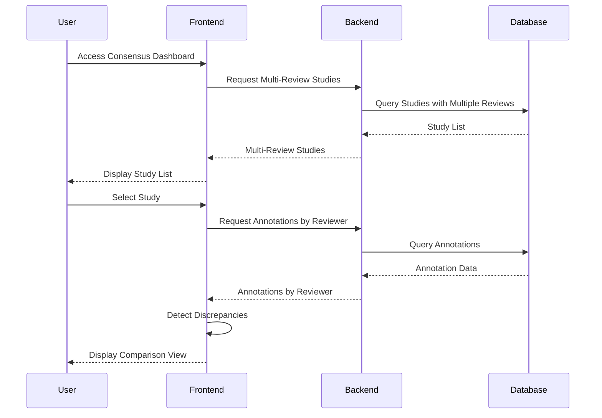
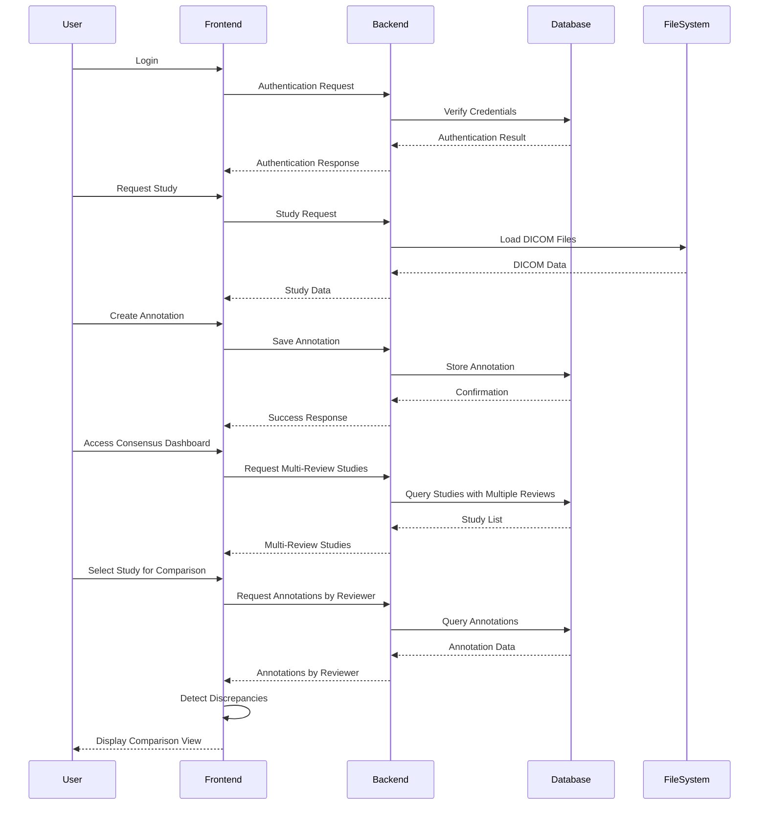

# 2. System Architecture

## 2.1 Technical Stack

The DICOM Multi-Reviewer System is built using a modern technology stack that balances performance, maintainability, and ease of development. This section details the complete technical stack used in the system.

### Development Environment

The system is developed and tested in the following environment:

- **Host Operating System**: Windows 11
- **Virtualization**: Windows Subsystem for Linux 2 (WSL2)
- **Linux Distribution**: Ubuntu 24.04.2 LTS
- **IDE**: Visual Studio Code with Remote WSL extension
- **Version Control**: Git



**Diagram Explanation:** The development environment consists of Windows 11 as the host operating system, running WSL2 with Ubuntu 24.04.2 LTS. Visual Studio Code with the Remote WSL extension is used as the primary IDE for development.

### Backend Components

The server-side components of the system include:

- **Programming Language**: Python 3.9+
- **Web Framework**: Flask
- **Database**: SQLite
- **ORM**: SQLAlchemy
- **Authentication**: Flask-Login
- **Password Hashing**: bcrypt
- **DICOM Processing**: pydicom
- **Image Processing**: Pillow, NumPy

```python
# Example from main.py showing the core backend components
from flask import Flask, jsonify, render_template, request, send_file, abort, redirect, url_for
import os
import pydicom
from PIL import Image
import numpy as np
from flask_login import LoginManager, login_user, logout_user, login_required, current_user
from dicom_reviewer.models.db import db
from dicom_reviewer.models.db.user import User
from dicom_reviewer.models.db.annotation import Annotation
```

### Frontend Components

The client-side components of the system include:

- **Markup**: HTML5
- **Styling**: CSS3
- **Scripting**: JavaScript (ES6+)
- **Drawing**: HTML5 Canvas API
- **DOM Manipulation**: Native JavaScript
- **Responsive Design**: CSS Flexbox and Grid

```javascript
// Example from annotation-viewer.js showing frontend components
document.addEventListener('DOMContentLoaded', function() {
    // Canvas-based drawing for annotations
    const canvas = document.getElementById('annotation-canvas');
    const ctx = canvas.getContext('2d');
    
    // DOM manipulation for UI controls
    const toolButtons = document.querySelectorAll('.tool-button');
    toolButtons.forEach(button => {
        button.addEventListener('click', function() {
            // Tool selection logic
        });
    });
});
```

### Complete Technical Stack Diagram



**Diagram Explanation:** The complete technical stack diagram illustrates the three main components of the system: the development environment (Windows/WSL2/Ubuntu/VS Code), the backend stack (Python/Flask/SQLite with various libraries), and the frontend stack (HTML5/CSS3/JavaScript with Canvas API for drawing annotations).

## 2.2 System Components

The DICOM Multi-Reviewer System is composed of several interconnected components that work together to provide a comprehensive solution for collaborative radiology review. This section details these components and their interactions.

### Authentication System

The authentication system manages user access and security:



**Diagram Explanation:** The authentication flow begins with the user entering their credentials in the frontend. These credentials are sent to the backend, which verifies them against the database. The authentication result is then returned to the frontend, which either grants access to the system or displays an error message.

Key components:
- **User Model**: Defines user attributes and methods
- **LoginManager**: Handles session management
- **Password Hashing**: Secures user passwords with bcrypt
- **Role-Based Access Control**: Restricts access based on user role

```python
# Example from user.py showing authentication implementation
class User(db.Model, UserMixin):
    __tablename__ = 'users'
    
    id = db.Column(db.Integer, primary_key=True)
    username = db.Column(db.String(80), unique=True, nullable=False)
    password_hash = db.Column(db.String(128), nullable=False)
    email = db.Column(db.String(120), unique=True, nullable=False)
    role = db.Column(db.String(20), nullable=False, default='radiologist')
    
    def set_password(self, password):
        self.password_hash = bcrypt.hashpw(password.encode('utf-8'), bcrypt.gensalt()).decode('utf-8')
    
    def check_password(self, password):
        return bcrypt.checkpw(password.encode('utf-8'), self.password_hash.encode('utf-8'))
```

### DICOM Processing Pipeline

The DICOM processing pipeline handles loading, parsing, and displaying medical images:



**Diagram Explanation:** When a user requests a study, the frontend sends a request to the backend, which loads the DICOM files from the filesystem. The backend processes the DICOM data (extracting metadata and converting pixel data) and sends it to the frontend, which displays the images to the user.

Key components:
- **DICOM Parser**: Extracts metadata and pixel data from DICOM files
- **Image Converter**: Transforms DICOM images to browser-viewable formats
- **Metadata Extractor**: Retrieves patient and study information
- **Study/Series/Instance Hierarchy**: Organizes DICOM data in proper hierarchy

```python
# Example from dicom_parser.py showing DICOM processing
class DICOMParser:
    @staticmethod
    def parse_dicom_file(file_path):
        """Parse a DICOM file and extract metadata and image data."""
        try:
            # Load the DICOM file
            dicom_data = pydicom.dcmread(file_path)
            
            # Extract metadata
            metadata = {
                'studyUid': dicom_data.StudyInstanceUID,
                'seriesUid': dicom_data.SeriesInstanceUID,
                'instanceUid': dicom_data.SOPInstanceUID,
                'patientId': dicom_data.PatientID,
                'patientName': str(dicom_data.PatientName),
                'studyDate': dicom_data.StudyDate,
                'modality': dicom_data.Modality,
                'rows': dicom_data.Rows,
                'columns': dicom_data.Columns
            }
            
            # Convert pixel data to image
            pixel_array = dicom_data.pixel_array
            
            return metadata, pixel_array
        except Exception as e:
            print(f"Error parsing DICOM file: {e}")
            return None, None
```

### Annotation System Architecture

The annotation system enables users to mark and describe findings on medical images:



**Diagram Explanation:** The annotation process begins with the user drawing on the canvas. The frontend captures this drawing data and combines it with metadata entered by the user. This complete annotation is sent to the backend, which stores it in the database. Confirmation is sent back through the system, and the UI is updated to reflect the saved annotation.

Key components:
- **Canvas Drawing Tools**: Interface for creating shapes on images
- **Annotation Model**: Data structure for storing annotation information
- **Persistence Layer**: Saves annotations to the database
- **Retrieval System**: Loads existing annotations for display

```javascript
// Example from annotation-viewer.js showing annotation creation
function saveAnnotation() {
    // Validate annotation data
    if (!currentAnnotation || currentAnnotation.shapes.length === 0) {
        alert('Please add at least one shape to the annotation.');
        return;
    }
    
    // Get metadata from form
    currentAnnotation.finding = document.getElementById('finding').value;
    currentAnnotation.confidence = parseInt(document.getElementById('confidence').value);
    currentAnnotation.notes = document.getElementById('notes').value;
    
    // Prepare data for API
    const annotationData = {
        id: currentAnnotation.id,
        studyUid: currentAnnotation.studyUid,
        seriesUid: currentAnnotation.seriesUid,
        instanceUid: currentAnnotation.instanceUid,
        finding: currentAnnotation.finding,
        confidence: currentAnnotation.confidence,
        notes: currentAnnotation.notes,
        shapes: currentAnnotation.shapes
    };
    
    // Send to server
    fetch('/api/annotations', {
        method: 'POST',
        headers: {
            'Content-Type': 'application/json',
        },
        body: JSON.stringify(annotationData)
    })
    .then(response => response.json())
    .then(data => {
        console.log('Annotation saved:', data);
        // Update UI
        loadAnnotations(studyUid);
    })
    .catch(error => {
        console.error('Error saving annotation:', error);
        alert('Error saving annotation. Please try again.');
    });
}
```

### Future Planned Features

The following components are planned for future implementation:

#### Consensus Dashboard Components

The consensus dashboard will facilitate comparison and resolution of discrepancies:



**Diagram Explanation:** The planned consensus workflow will begin with the user accessing the dashboard, which requests studies with multiple reviews from the database. When a study is selected, the system will retrieve all annotations for that study, grouped by reviewer. The frontend will detect discrepancies between these annotations and display them in a comparison view for analysis.

Key planned components:
- **Consensus Session Model**: Will track review sessions between multiple reviewers
- **Discussion System**: Will enable communication about discrepancies
- **Voting Mechanism**: Will allow reviewers to agree or disagree with findings
- **Discrepancy Detection**: Will identify differences between annotations
- **Visualization Tools**: Will display multiple annotations for comparison

### Data Flow Between Components

The overall data flow in the system follows this pattern:



**Diagram Explanation:** This comprehensive flow diagram illustrates the interactions between all system components, from user authentication to DICOM viewing and annotation creation. The final sections showing consensus dashboard interactions represent planned future functionality.

This architecture provides a robust foundation for the system while maintaining flexibility for future enhancements and extensions.
