# 6. User Workflows

This section documents the key user workflows within the DICOM Multi-Reviewer System, providing a comprehensive guide to how different user roles interact with the system to accomplish their tasks.

## 6.1 User Role Overview

The system supports two primary user roles, each with distinct permissions and capabilities:

### Administrator Role

Administrators have full system access and are responsible for:
- User management (creating, editing, and deactivating accounts)
- Study management (uploading, organizing, and assigning studies)
- Consensus session management (creating and monitoring sessions)
- System configuration and maintenance

### Radiologist Role

Radiologists are the primary end-users who:
- Review assigned DICOM studies
- Create and edit annotations
- Participate in consensus sessions
- View their own annotation history and statistics

## 6.2 Authentication Workflows

### User Registration

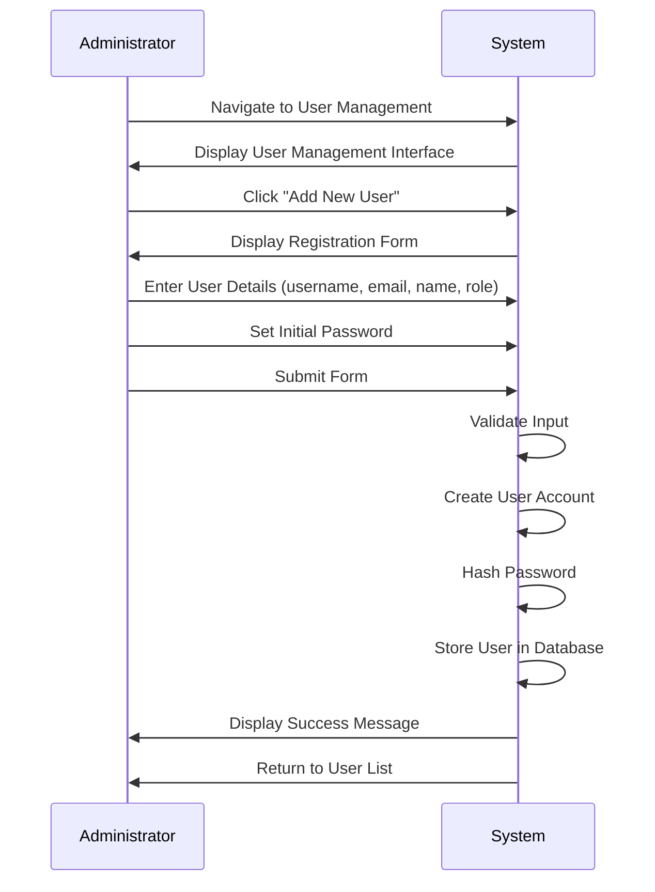
```mermaid
sequenceDiagram
    participant A as Administrator
    participant S as System
    
    A->>S: Navigate to User Management
    S->>A: Display User Management Interface
    A->>S: Click "Add New User"
    S->>A: Display Registration Form
    A->>S: Enter User Details (username, email, name, role)
    A->>S: Set Initial Password
    A->>S: Submit Form
    S->>S: Validate Input
    S->>S: Create User Account
    S->>S: Hash Password
    S->>S: Store User in Database
    S->>A: Display Success Message
    S->>A: Return to User List
```

### User Login

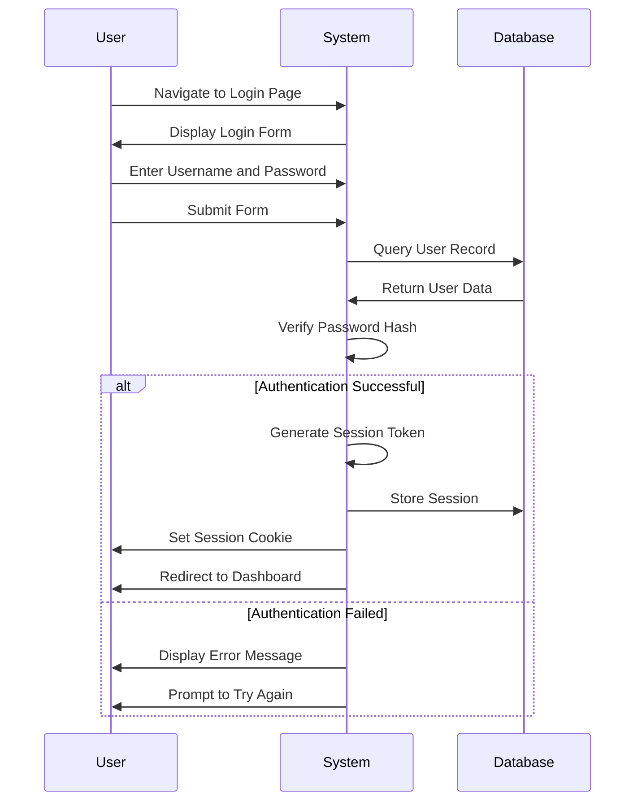
```mermaid
sequenceDiagram
    participant U as User
    participant S as System
    participant DB as Database
    
    U->>S: Navigate to Login Page
    S->>U: Display Login Form
    U->>S: Enter Username and Password
    U->>S: Submit Form
    S->>DB: Query User Record
    DB->>S: Return User Data
    S->>S: Verify Password Hash
    alt Authentication Successful
        S->>S: Generate Session Token
        S->>DB: Store Session
        S->>U: Set Session Cookie
        S->>U: Redirect to Dashboard
    else Authentication Failed
        S->>U: Display Error Message
        S->>U: Prompt to Try Again
    end
```

### Password Reset

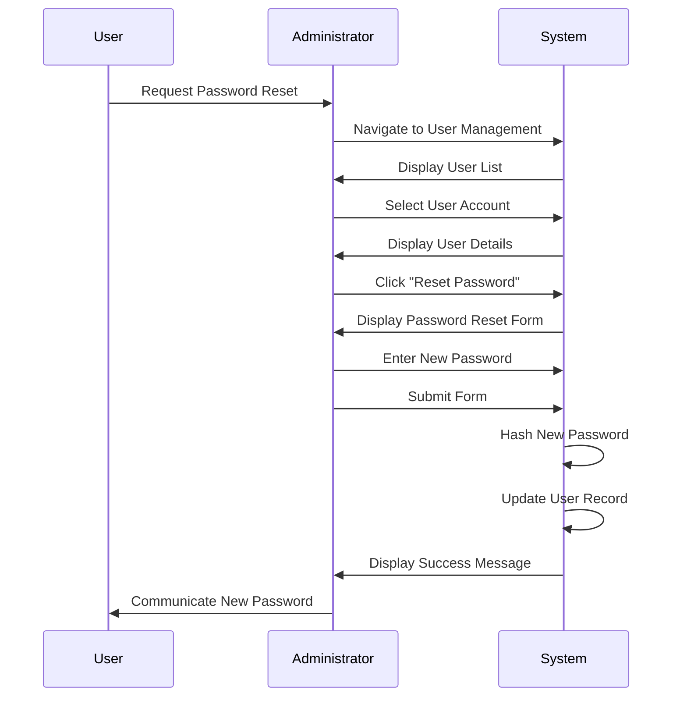
```mermaid
sequenceDiagram
    participant U as User
    participant A as Administrator
    participant S as System
    
    U->>A: Request Password Reset
    A->>S: Navigate to User Management
    S->>A: Display User List
    A->>S: Select User Account
    S->>A: Display User Details
    A->>S: Click "Reset Password"
    S->>A: Display Password Reset Form
    A->>S: Enter New Password
    A->>S: Submit Form
    S->>S: Hash New Password
    S->>S: Update User Record
    S->>A: Display Success Message
    A->>U: Communicate New Password
```

## 6.3 Study Management Workflows

### Uploading DICOM Studies

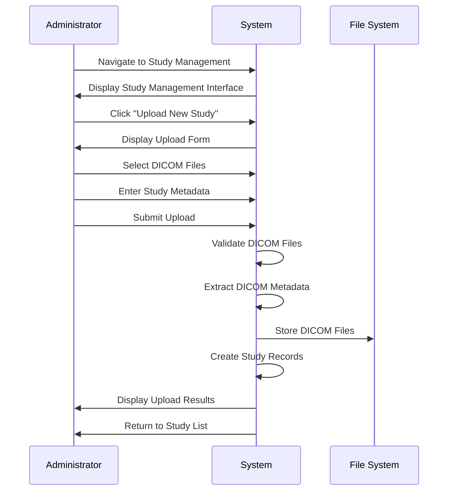
```mermaid
sequenceDiagram
    participant A as Administrator
    participant S as System
    participant FS as File System
    
    A->>S: Navigate to Study Management
    S->>A: Display Study Management Interface
    A->>S: Click "Upload New Study"
    S->>A: Display Upload Form
    A->>S: Select DICOM Files
    A->>S: Enter Study Metadata
    A->>S: Submit Upload
    S->>S: Validate DICOM Files
    S->>S: Extract DICOM Metadata
    S->>FS: Store DICOM Files
    S->>S: Create Study Records
    S->>A: Display Upload Results
    S->>A: Return to Study List
```

### Assigning Studies to Radiologists

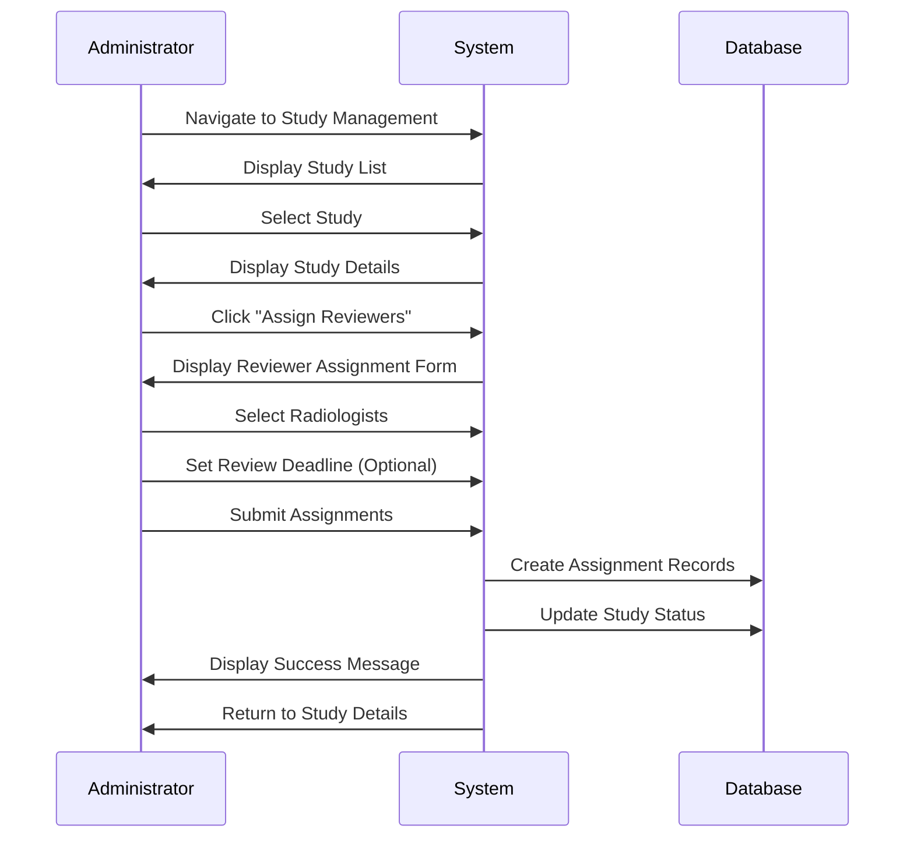
```mermaid
sequenceDiagram
    participant A as Administrator
    participant S as System
    participant DB as Database
    
    A->>S: Navigate to Study Management
    S->>A: Display Study List
    A->>S: Select Study
    S->>A: Display Study Details
    A->>S: Click "Assign Reviewers"
    S->>A: Display Reviewer Assignment Form
    A->>S: Select Radiologists
    A->>S: Set Review Deadline (Optional)
    A->>S: Submit Assignments
    S->>DB: Create Assignment Records
    S->>DB: Update Study Status
    S->>A: Display Success Message
    S->>A: Return to Study Details
```

## 6.4 DICOM Viewing and Annotation Workflows

### Accessing Assigned Studies

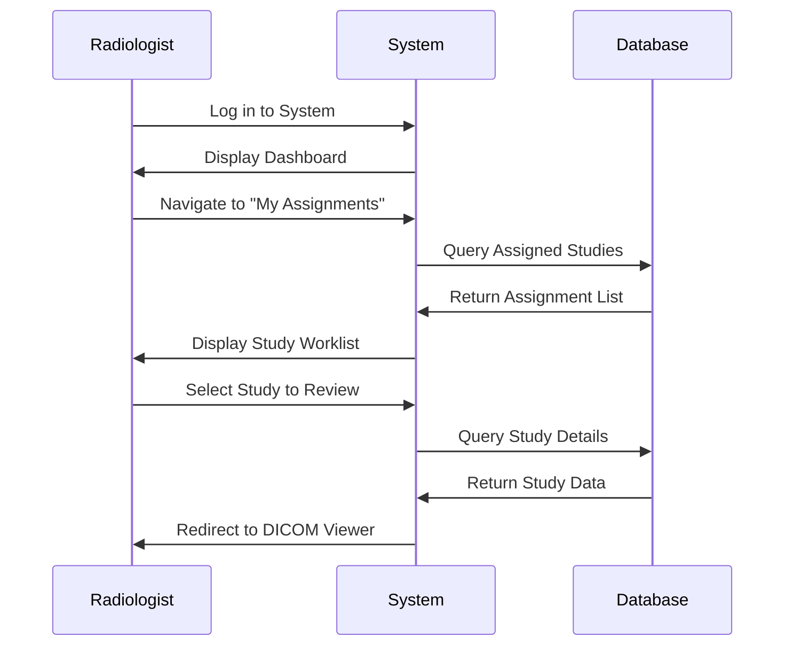
```mermaid
sequenceDiagram
    participant R as Radiologist
    participant S as System
    participant DB as Database
    
    R->>S: Log in to System
    S->>R: Display Dashboard
    R->>S: Navigate to "My Assignments"
    S->>DB: Query Assigned Studies
    DB->>S: Return Assignment List
    S->>R: Display Study Worklist
    R->>S: Select Study to Review
    S->>DB: Query Study Details
    DB->>S: Return Study Data
    S->>R: Redirect to DICOM Viewer
```

### Creating Annotations

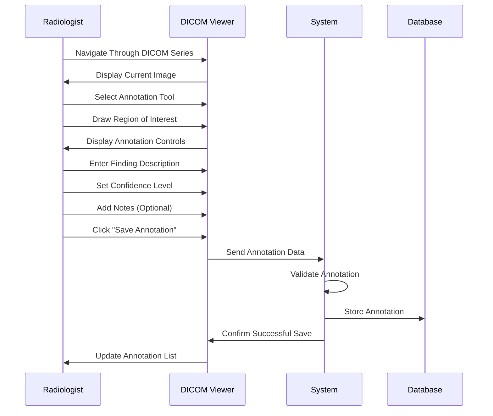
```mermaid
sequenceDiagram
    participant R as Radiologist
    participant V as DICOM Viewer
    participant S as System
    participant DB as Database
    
    R->>V: Navigate Through DICOM Series
    V->>R: Display Current Image
    R->>V: Select Annotation Tool
    R->>V: Draw Region of Interest
    V->>R: Display Annotation Controls
    R->>V: Enter Finding Description
    R->>V: Set Confidence Level
    R->>V: Add Notes (Optional)
    R->>V: Click "Save Annotation"
    V->>S: Send Annotation Data
    S->>S: Validate Annotation
    S->>DB: Store Annotation
    S->>V: Confirm Successful Save
    V->>R: Update Annotation List
```

### Editing Existing Annotations

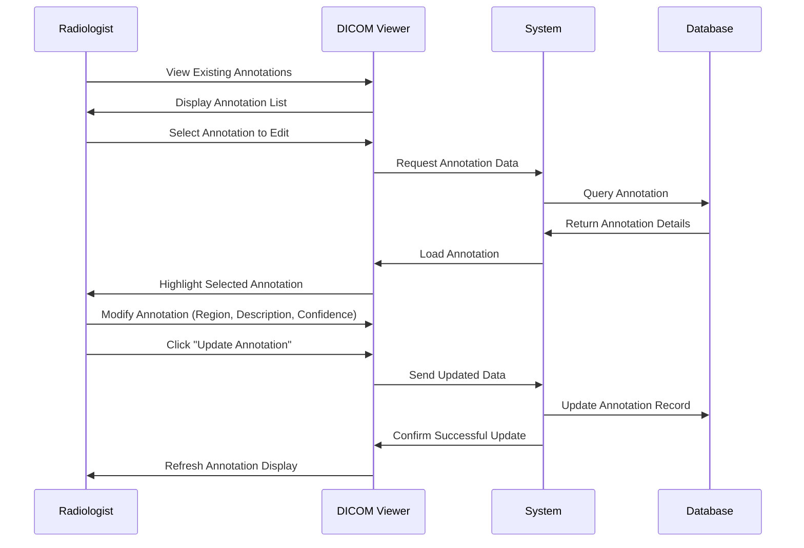
```mermaid
sequenceDiagram
    participant R as Radiologist
    participant V as DICOM Viewer
    participant S as System
    participant DB as Database
    
    R->>V: View Existing Annotations
    V->>R: Display Annotation List
    R->>V: Select Annotation to Edit
    V->>S: Request Annotation Data
    S->>DB: Query Annotation
    DB->>S: Return Annotation Details
    S->>V: Load Annotation
    V->>R: Highlight Selected Annotation
    R->>V: Modify Annotation (Region, Description, Confidence)
    R->>V: Click "Update Annotation"
    V->>S: Send Updated Data
    S->>DB: Update Annotation Record
    S->>V: Confirm Successful Update
    V->>R: Refresh Annotation Display
```

### Completing a Study Review

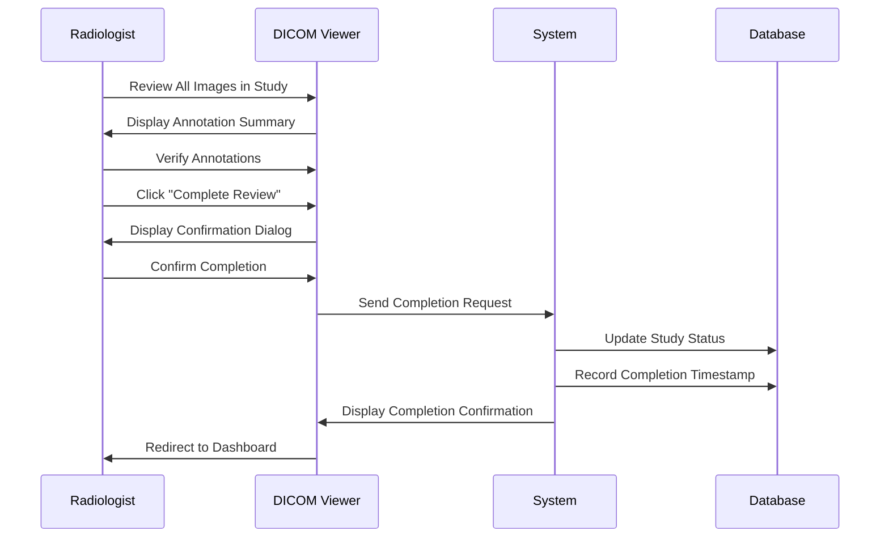
```mermaid
sequenceDiagram
    participant R as Radiologist
    participant V as DICOM Viewer
    participant S as System
    participant DB as Database
    
    R->>V: Review All Images in Study
    V->>R: Display Annotation Summary
    R->>V: Verify Annotations
    R->>V: Click "Complete Review"
    V->>R: Display Confirmation Dialog
    R->>V: Confirm Completion
    V->>S: Send Completion Request
    S->>DB: Update Study Status
    S->>DB: Record Completion Timestamp
    S->>V: Display Completion Confirmation
    V->>R: Redirect to Dashboard
```

## 6.5 Consensus Workflows

### Creating a Consensus Session

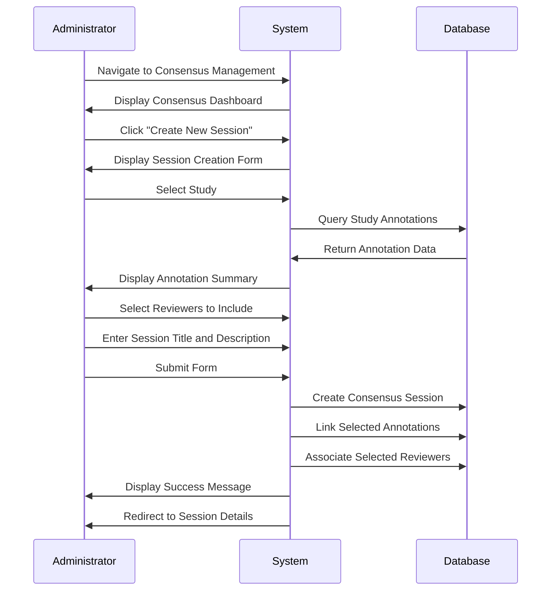
```mermaid
sequenceDiagram
    participant A as Administrator
    participant S as System
    participant DB as Database
    
    A->>S: Navigate to Consensus Management
    S->>A: Display Consensus Dashboard
    A->>S: Click "Create New Session"
    S->>A: Display Session Creation Form
    A->>S: Select Study
    S->>DB: Query Study Annotations
    DB->>S: Return Annotation Data
    S->>A: Display Annotation Summary
    A->>S: Select Reviewers to Include
    A->>S: Enter Session Title and Description
    A->>S: Submit Form
    S->>DB: Create Consensus Session
    S->>DB: Link Selected Annotations
    S->>DB: Associate Selected Reviewers
    S->>A: Display Success Message
    S->>A: Redirect to Session Details
```

### Participating in a Consensus Session

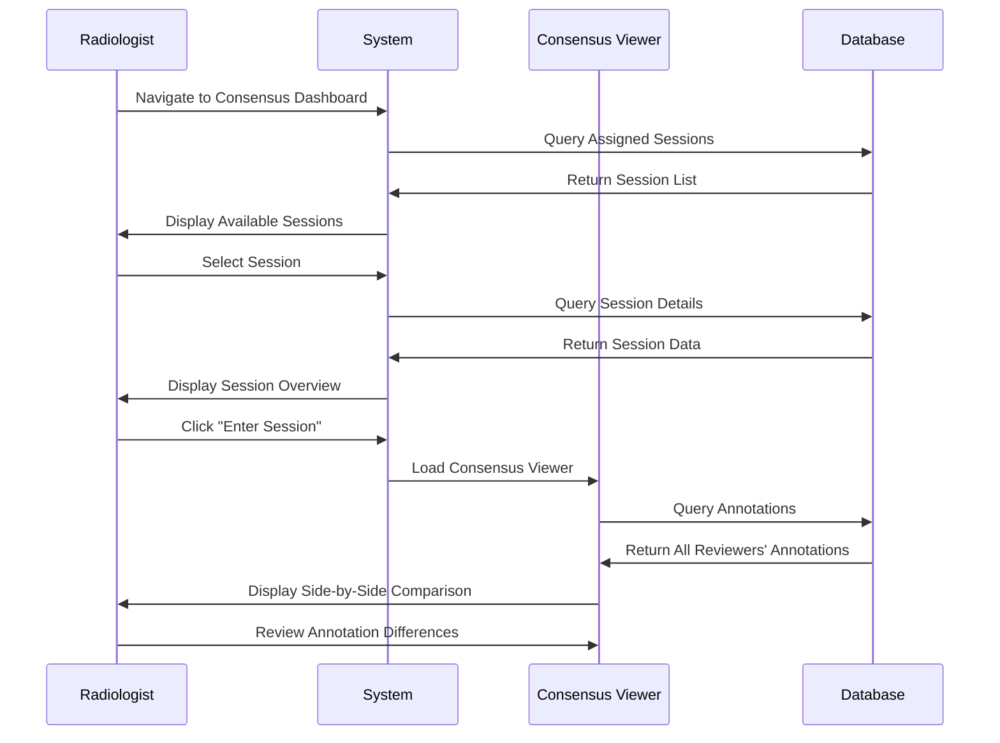
```mermaid
sequenceDiagram
    participant R as Radiologist
    participant S as System
    participant V as Consensus Viewer
    participant DB as Database
    
    R->>S: Navigate to Consensus Dashboard
    S->>DB: Query Assigned Sessions
    DB->>S: Return Session List
    S->>R: Display Available Sessions
    R->>S: Select Session
    S->>DB: Query Session Details
    DB->>S: Return Session Data
    S->>R: Display Session Overview
    R->>S: Click "Enter Session"
    S->>V: Load Consensus Viewer
    V->>DB: Query Annotations
    DB->>V: Return All Reviewers' Annotations
    V->>R: Display Side-by-Side Comparison
    R->>V: Review Annotation Differences
```

### Discussing Discrepancies

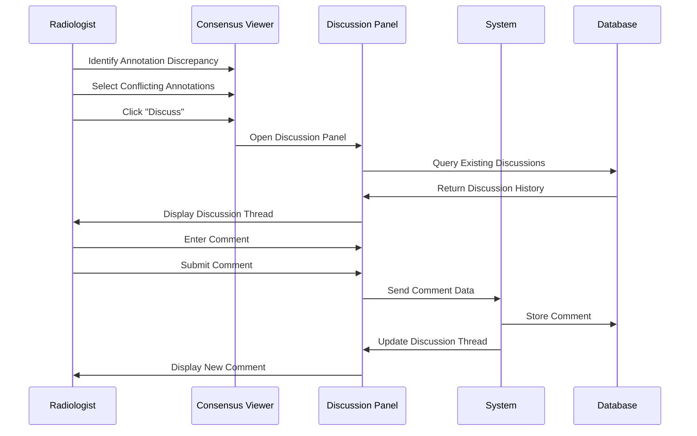
```mermaid
sequenceDiagram
    participant R as Radiologist
    participant V as Consensus Viewer
    participant D as Discussion Panel
    participant S as System
    participant DB as Database
    
    R->>V: Identify Annotation Discrepancy
    R->>V: Select Conflicting Annotations
    R->>V: Click "Discuss"
    V->>D: Open Discussion Panel
    D->>DB: Query Existing Discussions
    DB->>D: Return Discussion History
    D->>R: Display Discussion Thread
    R->>D: Enter Comment
    R->>D: Submit Comment
    D->>S: Send Comment Data
    S->>DB: Store Comment
    S->>D: Update Discussion Thread
    D->>R: Display New Comment
```

### Voting on Consensus

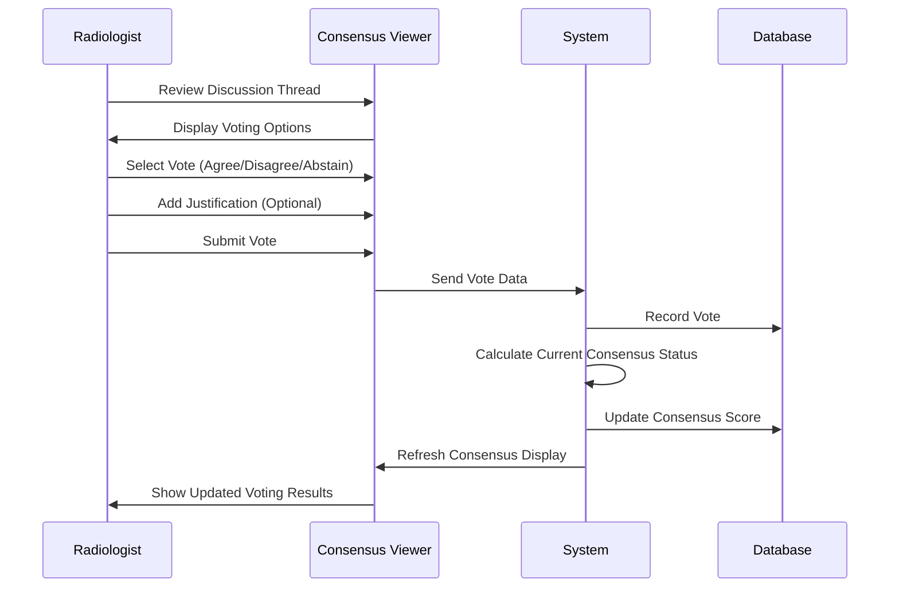
```mermaid
sequenceDiagram
    participant R as Radiologist
    participant V as Consensus Viewer
    participant S as System
    participant DB as Database
    
    R->>V: Review Discussion Thread
    V->>R: Display Voting Options
    R->>V: Select Vote (Agree/Disagree/Abstain)
    R->>V: Add Justification (Optional)
    R->>V: Submit Vote
    V->>S: Send Vote Data
    S->>DB: Record Vote
    S->>S: Calculate Current Consensus Status
    S->>DB: Update Consensus Score
    S->>V: Refresh Consensus Display
    V->>R: Show Updated Voting Results
```

### Creating Consensus Results

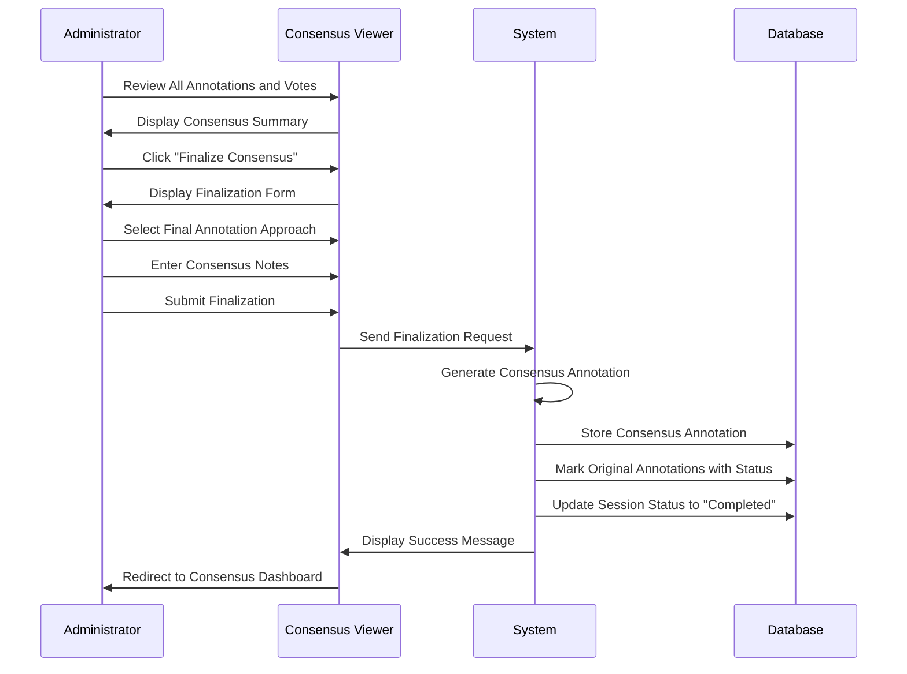
```mermaid
sequenceDiagram
    participant A as Administrator
    participant V as Consensus Viewer
    participant S as System
    participant DB as Database
    
    A->>V: Review All Annotations and Votes
    V->>A: Display Consensus Summary
    A->>V: Click "Finalize Consensus"
    V->>A: Display Finalization Form
    A->>V: Select Final Annotation Approach
    A->>V: Enter Consensus Notes
    A->>V: Submit Finalization
    V->>S: Send Finalization Request
    S->>S: Generate Consensus Annotation
    S->>DB: Store Consensus Annotation
    S->>DB: Mark Original Annotations with Status
    S->>DB: Update Session Status to "Completed"
    S->>V: Display Success Message
    V->>A: Redirect to Consensus Dashboard
```

## 6.6 Reporting and Analytics Workflows

### Viewing Personal Statistics

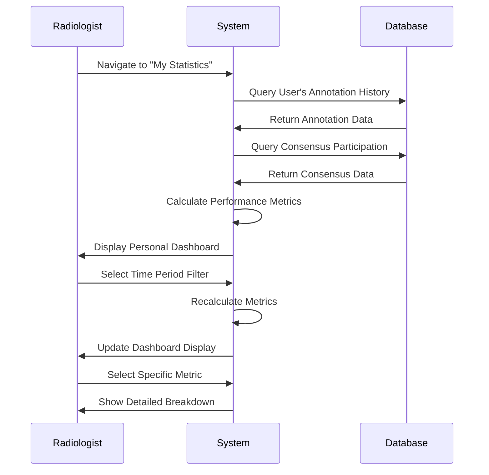
```mermaid
sequenceDiagram
    participant R as Radiologist
    participant S as System
    participant DB as Database
    
    R->>S: Navigate to "My Statistics"
    S->>DB: Query User's Annotation History
    DB->>S: Return Annotation Data
    S->>DB: Query Consensus Participation
    DB->>S: Return Consensus Data
    S->>S: Calculate Performance Metrics
    S->>R: Display Personal Dashboard
    R->>S: Select Time Period Filter
    S->>S: Recalculate Metrics
    S->>R: Update Dashboard Display
    R->>S: Select Specific Metric
    S->>R: Show Detailed Breakdown
```

### Generating System Reports

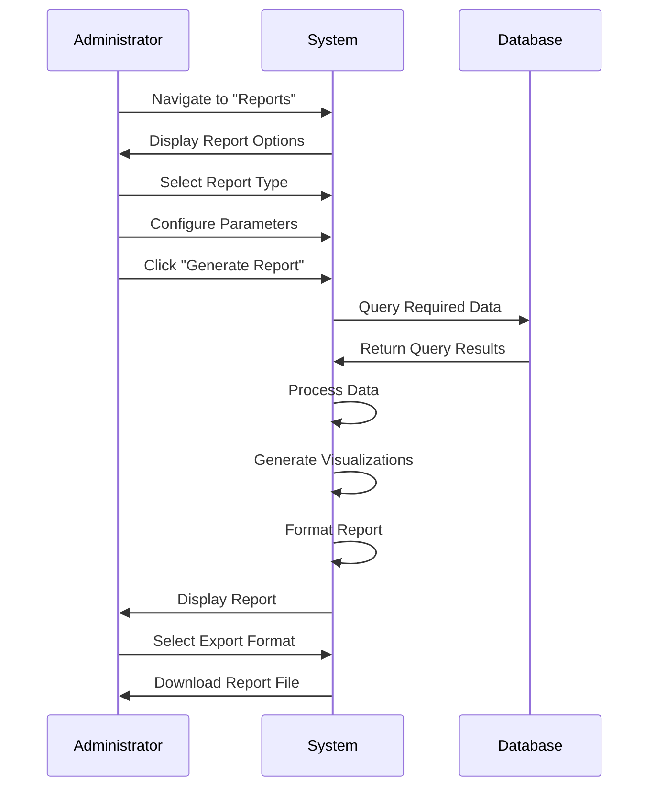
```mermaid
sequenceDiagram
    participant A as Administrator
    participant S as System
    participant DB as Database
    
    A->>S: Navigate to "Reports"
    S->>A: Display Report Options
    A->>S: Select Report Type
    A->>S: Configure Parameters
    A->>S: Click "Generate Report"
    S->>DB: Query Required Data
    DB->>S: Return Query Results
    S->>S: Process Data
    S->>S: Generate Visualizations
    S->>S: Format Report
    S->>A: Display Report
    A->>S: Select Export Format
    S->>A: Download Report File
```

### Analyzing Consensus Metrics

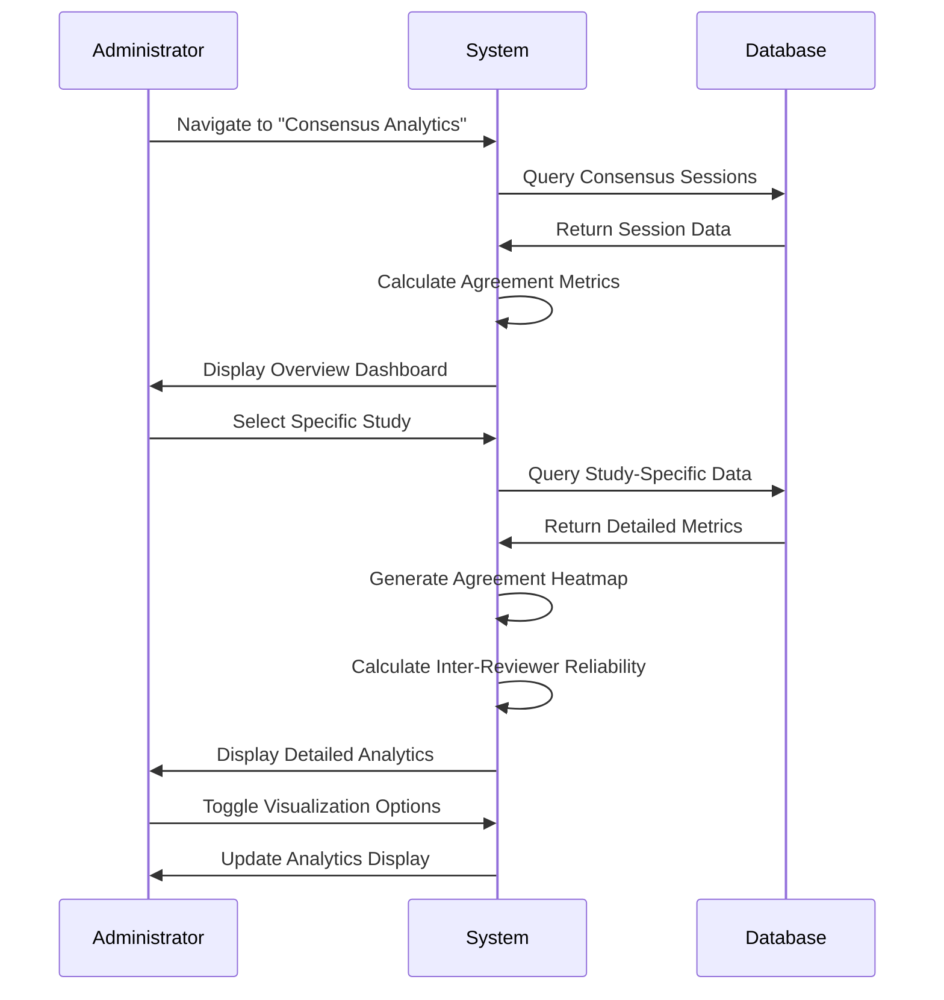
```mermaid
sequenceDiagram
    participant A as Administrator
    participant S as System
    participant DB as Database
    
    A->>S: Navigate to "Consensus Analytics"
    S->>DB: Query Consensus Sessions
    DB->>S: Return Session Data
    S->>S: Calculate Agreement Metrics
    S->>A: Display Overview Dashboard
    A->>S: Select Specific Study
    S->>DB: Query Study-Specific Data
    DB->>S: Return Detailed Metrics
    S->>S: Generate Agreement Heatmap
    S->>S: Calculate Inter-Reviewer Reliability
    S->>A: Display Detailed Analytics
    A->>S: Toggle Visualization Options
    S->>A: Update Analytics Display
```

## 6.7 System Administration Workflows

### Managing User Accounts

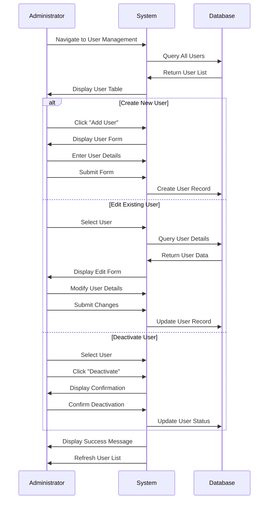
```mermaid
sequenceDiagram
    participant A as Administrator
    participant S as System
    participant DB as Database
    
    A->>S: Navigate to User Management
    S->>DB: Query All Users
    DB->>S: Return User List
    S->>A: Display User Table
    
    alt Create New User
        A->>S: Click "Add User"
        S->>A: Display User Form
        A->>S: Enter User Details
        A->>S: Submit Form
        S->>DB: Create User Record
    else Edit Existing User
        A->>S: Select User
        S->>DB: Query User Details
        DB->>S: Return User Data
        S->>A: Display Edit Form
        A->>S: Modify User Details
        A->>S: Submit Changes
        S->>DB: Update User Record
    else Deactivate User
        A->>S: Select User
        A->>S: Click "Deactivate"
        S->>A: Display Confirmation
        A->>S: Confirm Deactivation
        S->>DB: Update User Status
    end
    
    S->>A: Display Success Message
    S->>A: Refresh User List
```

### Configuring System Settings

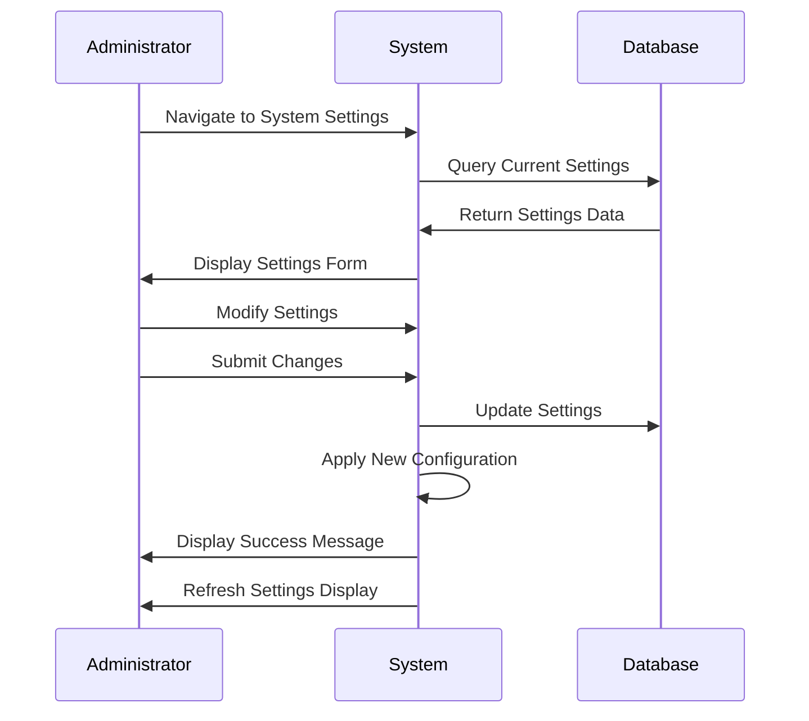
```mermaid
sequenceDiagram
    participant A as Administrator
    participant S as System
    participant DB as Database
    
    A->>S: Navigate to System Settings
    S->>DB: Query Current Settings
    DB->>S: Return Settings Data
    S->>A: Display Settings Form
    A->>S: Modify Settings
    A->>S: Submit Changes
    S->>DB: Update Settings
    S->>S: Apply New Configuration
    S->>A: Display Success Message
    S->>A: Refresh Settings Display
```

### Monitoring System Activity

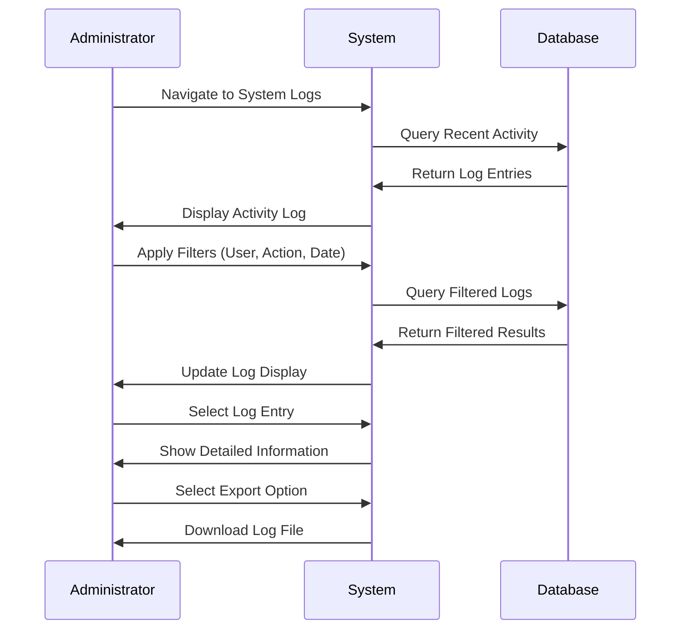
```mermaid
sequenceDiagram
    participant A as Administrator
    participant S as System
    participant DB as Database
    
    A->>S: Navigate to System Logs
    S->>DB: Query Recent Activity
    DB->>S: Return Log Entries
    S->>A: Display Activity Log
    A->>S: Apply Filters (User, Action, Date)
    S->>DB: Query Filtered Logs
    DB->>S: Return Filtered Results
    S->>A: Update Log Display
    A->>S: Select Log Entry
    S->>A: Show Detailed Information
    A->>S: Select Export Option
    S->>A: Download Log File
```

## 6.8 Integration with External Systems

### PACS Integration Workflow

```mermaid
sequenceDiagram
    participant P as PACS System
    participant I as Integration Service
    participant S as DICOM Multi-Reviewer
    participant DB as Database
    
    P->>I: Send New Study Notification
    I->>I: Validate Study Metadata
    I->>P: Request DICOM Files
    P->>I: Transfer DICOM Data
    I->>I: Process DICOM Files
    I->>S: Send Study Information
    S->>DB: Create Study Records
    S->>I: Confirm Receipt
    I->>P: Acknowledge Successful Transfer
    
    alt Auto-Assignment Enabled
        S->>DB: Query Assignment Rules
        DB->>S: Return Rules
        S->>S: Apply Assignment Logic
        S->>DB: Create Automatic Assignments
        S->>S: Generate Notifications
    end
```

### Results Export Workflow

```mermaid
sequenceDiagram
    participant A as Administrator
    participant S as System
    participant E as Export Service
    participant R as Receiving System
    
    A->>S: Navigate to Completed Studies
    S->>A: Display Study List
    A->>S: Select Study
    A->>S: Click "Export Results"
    S->>A: Display Export Options
    A->>S: Configure Export Format
    A->>S: Select Destination System
    A->>S: Submit Export Request
    S->>E: Send Export Command
    E->>S: Request Consensus Results
    S->>E: Provide Study Data
    E->>E: Format Data for Export
    E->>R: Transmit Results
    R->>E: Acknowledge Receipt
    E->>S: Report Export Status
    S->>A: Display Export Confirmation
```

These detailed workflow diagrams provide a comprehensive guide to the user interactions within the DICOM Multi-Reviewer System, helping users understand how to effectively utilize the system's features for their specific roles and responsibilities.
