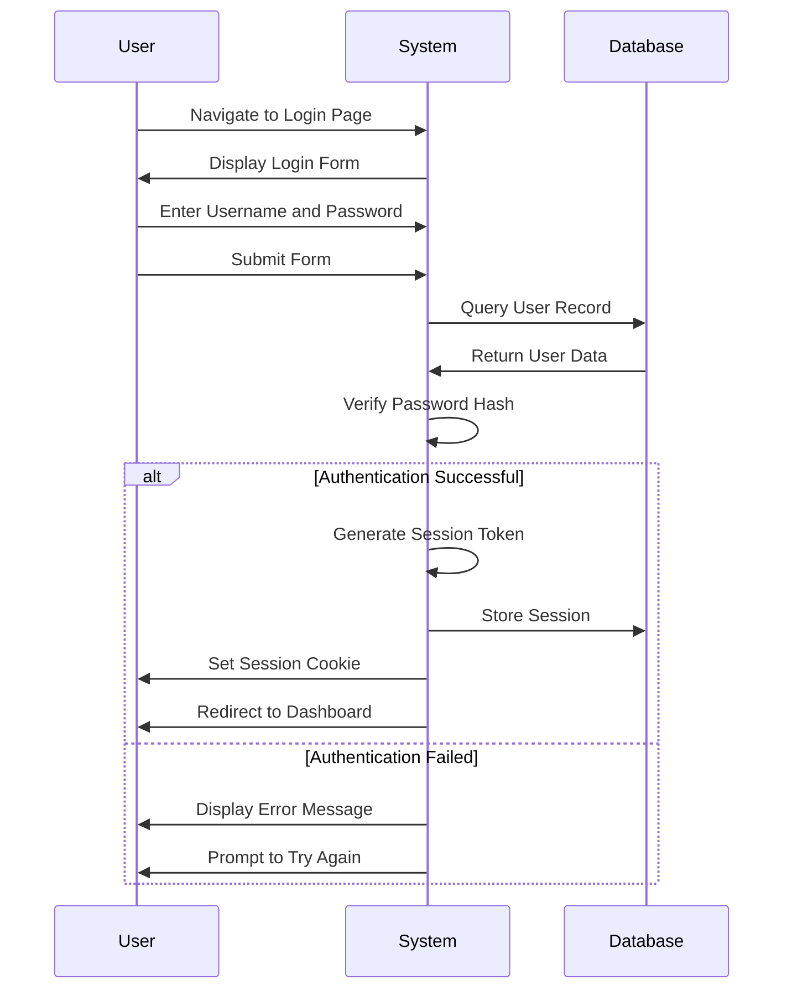
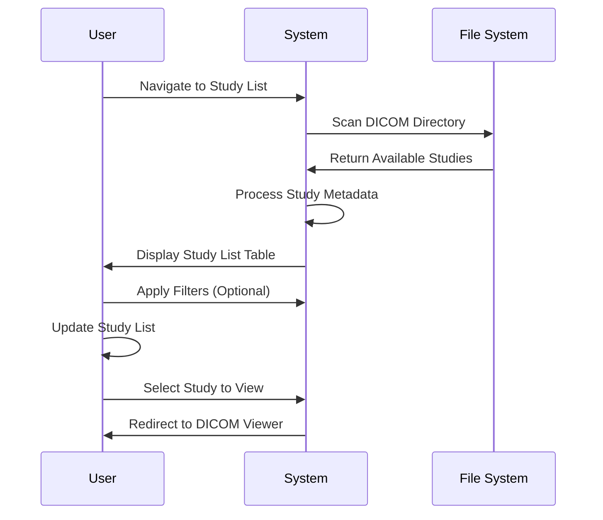
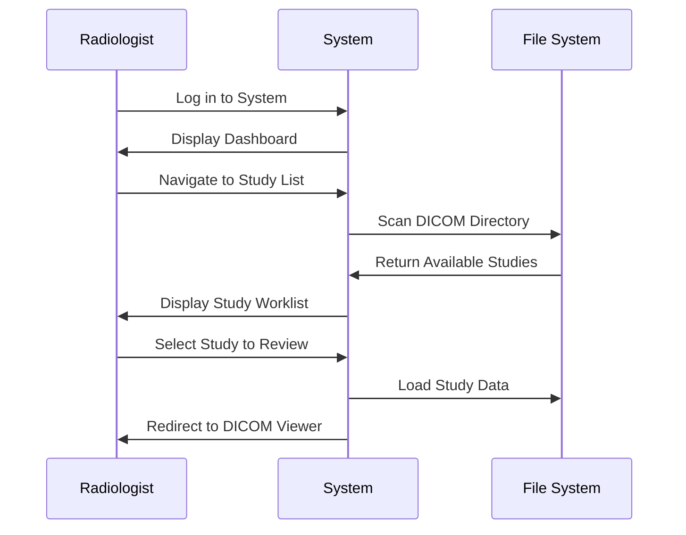
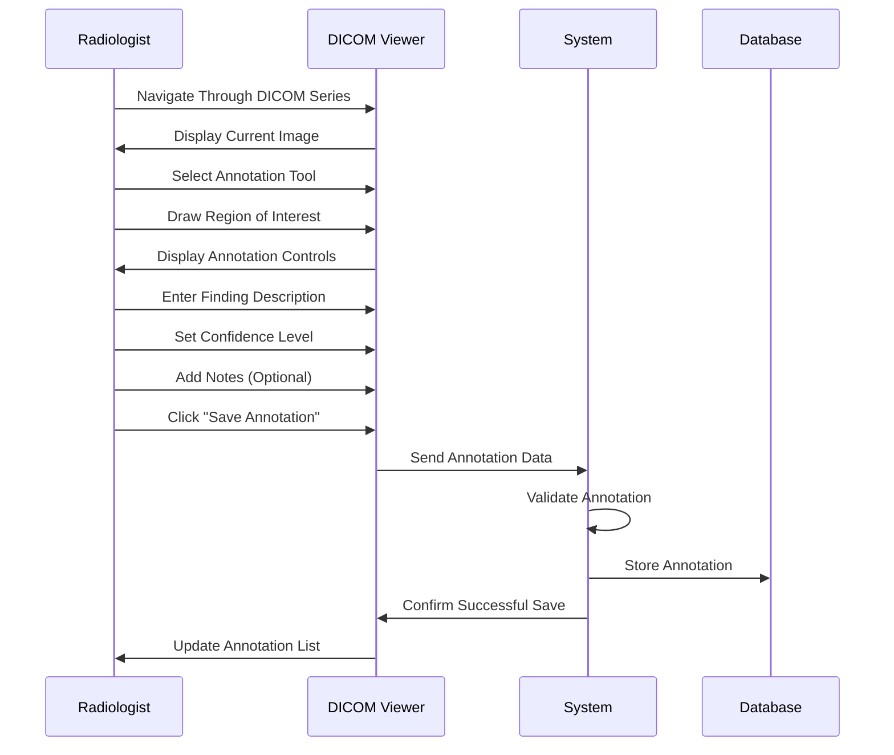
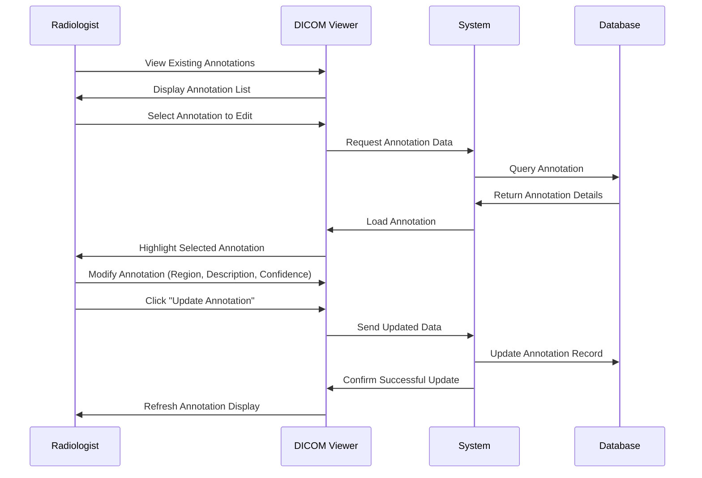
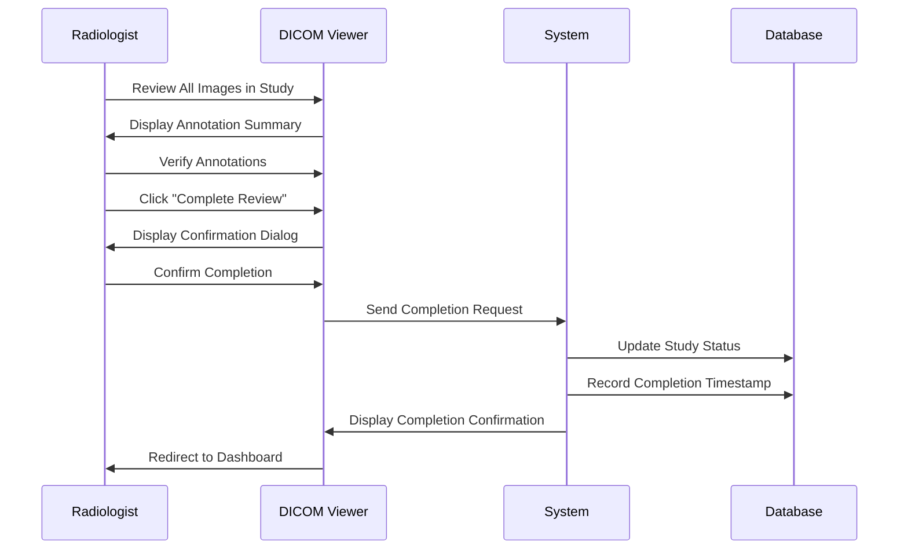
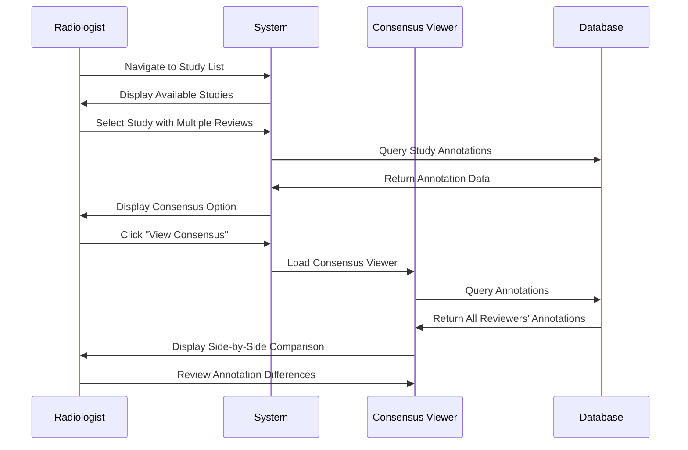
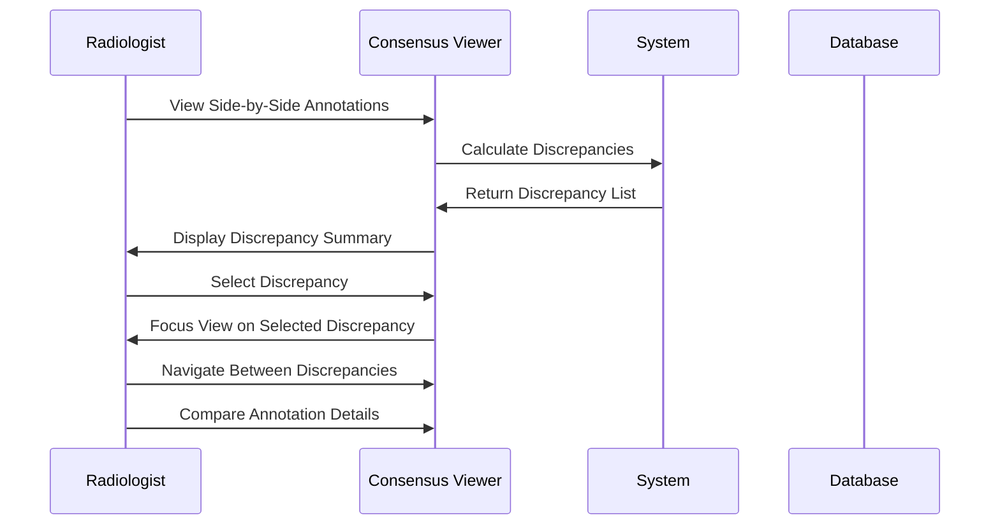

# 6. User Workflows

This section documents the key user workflows within the DICOM Multi-Reviewer System, providing a comprehensive guide to how different user roles interact with the system to accomplish their tasks.

## 6.1 User Role Overview

The system supports two primary user roles, each with distinct permissions and capabilities:

### Administrator Role

Administrators have system access with the following capabilities:
- View all studies in the system
- View annotations from all radiologists
- Access the consensus comparison viewer

### Radiologist Role

Radiologists are the primary end-users who:
- Review DICOM studies
- Create and edit annotations
- Participate in consensus comparisons
- View their own annotation history

## 6.2 Authentication Workflows

### User Login

## 6.3 Study Management Workflows

### Accessing Available Studies

## 6.4 DICOM Viewing and Annotation Workflows

### Accessing Studies

### Creating Annotations

### Editing Existing Annotations

### Completing a Study Review

## 6.5 Consensus Workflows

### Accessing the Consensus Comparison Viewer

### Reviewing Discrepancies

## 6.6 Future Planned Workflows

The following workflows represent planned functionality for future versions of the system:

1. **User Management Interface**: An administrative interface for creating and managing user accounts
2. **DICOM Upload Interface**: A user interface for uploading new DICOM studies to the system
3. **Consensus Discussion and Voting**: Formal tools for discussing and voting on annotation discrepancies
4. **Reporting and Analytics**: Statistical reports and performance metrics
5. **System Configuration Interface**: Administrative tools for configuring system settings
