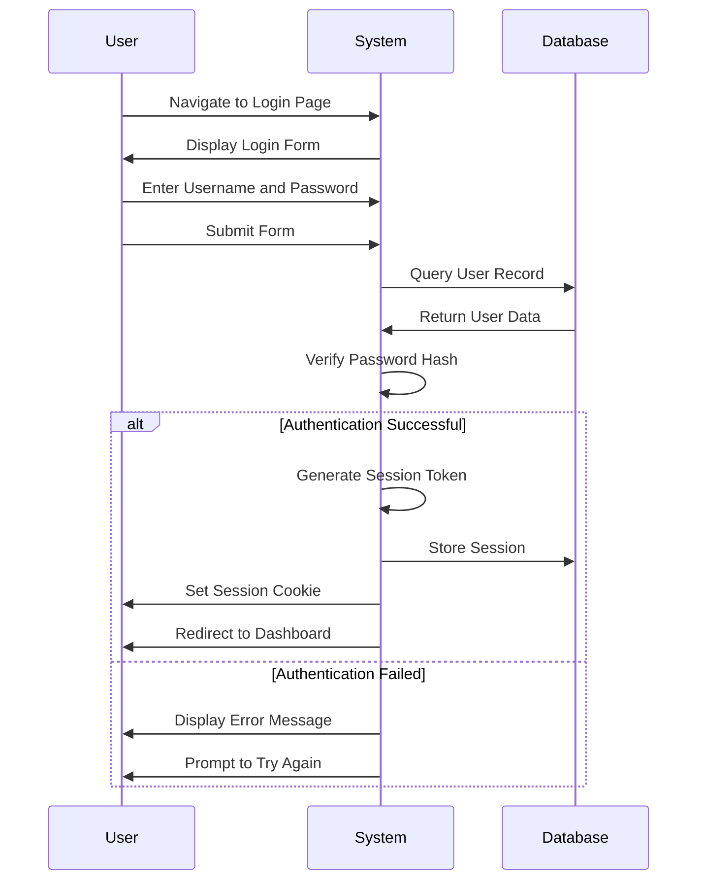
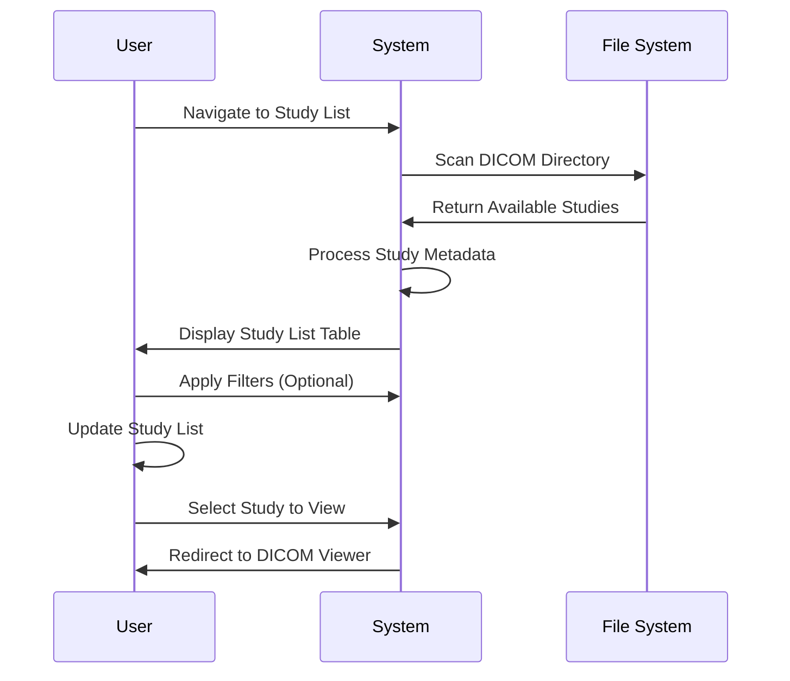
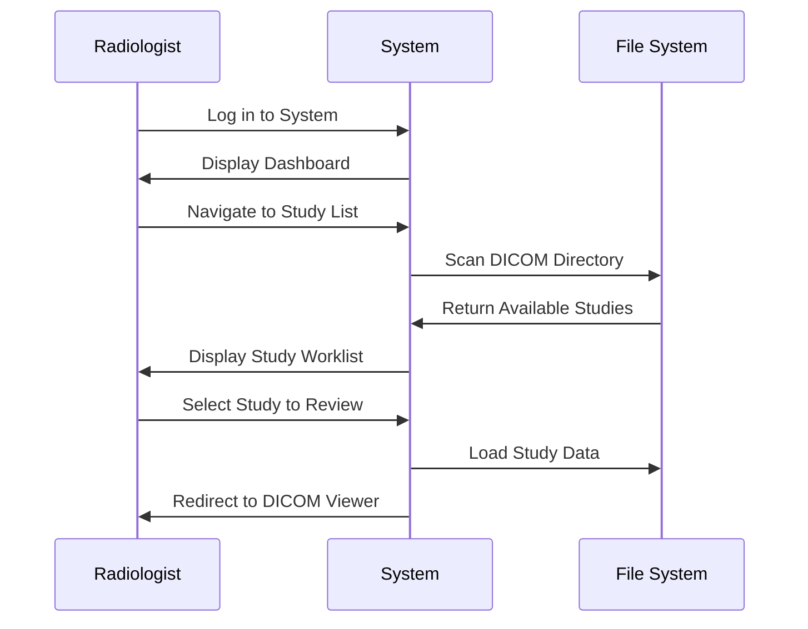
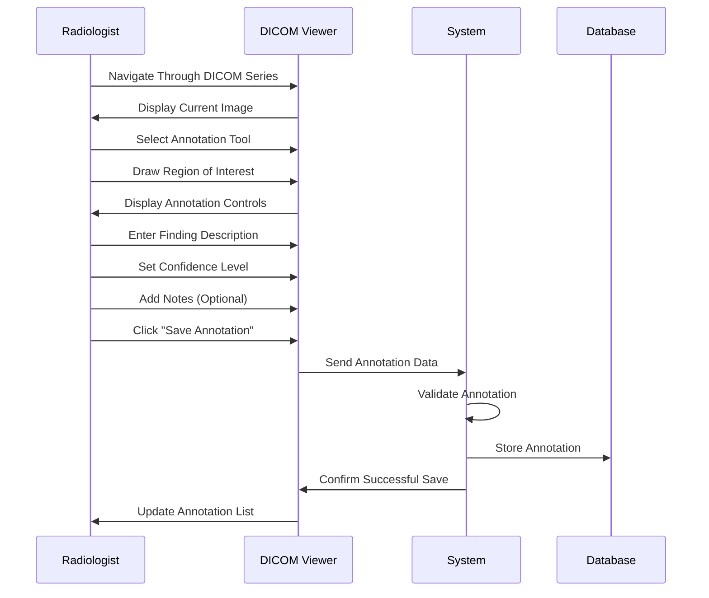
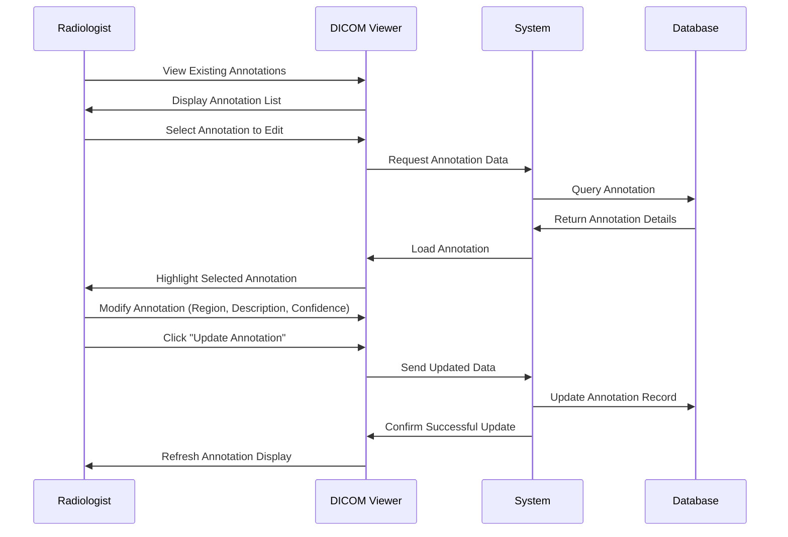
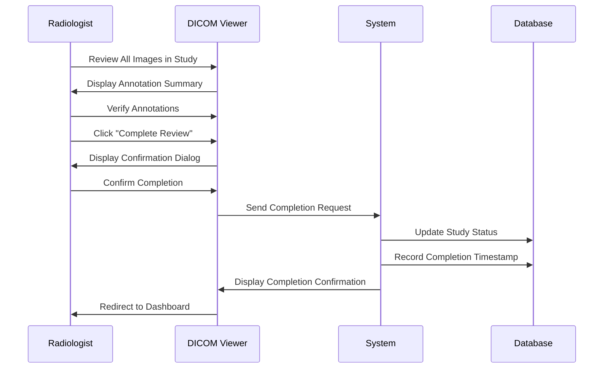
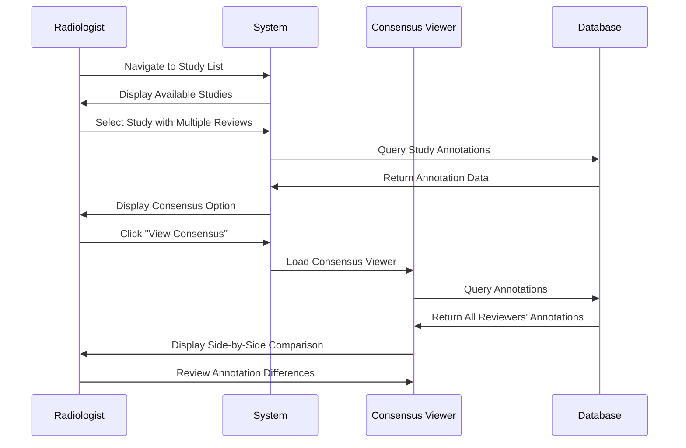
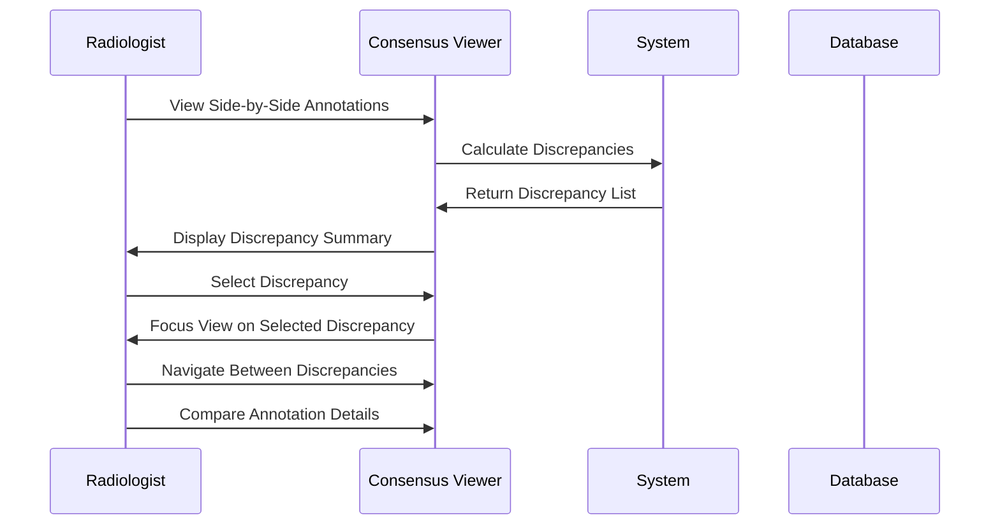

# 6. User Workflows

This section documents the key user workflows within the DICOM Multi-Reviewer System, providing a comprehensive guide to how different user roles interact with the system to accomplish their tasks.

## 6.1 User Role Overview

The system supports two primary user roles, each with distinct permissions and capabilities:

### Administrator Role

Administrators have system access with the following capabilities:
- View all studies in the system
- View annotations from all radiologists
- Access the consensus comparison viewer

### Radiologist Role

Radiologists are the primary end-users who:
- Review DICOM studies
- Create and edit annotations
- Participate in consensus comparisons
- View their own annotation history

## 6.2 Authentication Workflows

### User Login

**Explanation:** This diagram illustrates the login process. Users enter their credentials on the login page, which are verified against the database. If authentication is successful, a session token is generated and stored, and the user is redirected to the dashboard. If authentication fails, an error message is displayed, and the user is prompted to try again.

## 6.3 Study Management Workflows

### Accessing Available Studies

**Explanation:** This workflow shows how users access available DICOM studies. The system scans the configured DICOM directory to find available studies, processes the metadata, and presents them in a table format. Users can optionally filter the list and select a study to view, which redirects them to the DICOM viewer.

## 6.4 DICOM Viewing and Annotation Workflows

### Accessing Studies

**Explanation:** This diagram shows how radiologists access studies for review. After logging in, they navigate to the study list where the system scans the DICOM directory and displays available studies. When a radiologist selects a study, the system loads the study data from the file system and redirects to the DICOM viewer.

### Creating Annotations

**Explanation:** This workflow depicts the annotation creation process. Radiologists navigate through DICOM images, select an annotation tool, and draw regions of interest. They then enter metadata such as finding description, confidence level, and optional notes. When they save the annotation, the data is validated and stored in the database, and the annotation list is updated in the viewer.

### Editing Existing Annotations

**Explanation:** This diagram shows how radiologists edit existing annotations. They select an annotation from the list, which loads the annotation data from the database. The selected annotation is highlighted, allowing the radiologist to modify its properties. When they submit the update, the changes are saved to the database and the display is refreshed.

### Completing a Study Review

**Explanation:** This workflow illustrates the process of completing a study review. After reviewing all images and verifying annotations, the radiologist marks the review as complete. The system updates the study status in the database, records the completion timestamp, and redirects the radiologist back to the dashboard.

## 6.5 Consensus Workflows

### Accessing the Consensus Comparison Viewer

**Explanation:** This diagram shows how users access the consensus comparison viewer. From the study list, they select a study that has multiple reviews, and the system checks for annotations from different reviewers. When the user clicks to view the consensus, the system loads all annotations for the study and displays them side-by-side, allowing the user to review differences between annotations.

### Reviewing Discrepancies

**Explanation:** This workflow illustrates how users review discrepancies in the consensus viewer. The system calculates differences between annotations and presents a summary of discrepancies. Users can select specific discrepancies to focus on, navigate between them, and compare the details of different annotations to understand the differences in interpretation.

## 6.6 Future Planned Workflows

The following workflows represent planned functionality for future versions of the system:

1. **User Management Interface**: An administrative interface for creating and managing user accounts
2. **DICOM Upload Interface**: A user interface for uploading new DICOM studies to the system
3. **Consensus Discussion and Voting**: Formal tools for discussing and voting on annotation discrepancies
4. **Reporting and Analytics**: Statistical reports and performance metrics
5. **System Configuration Interface**: Administrative tools for configuring system settings
